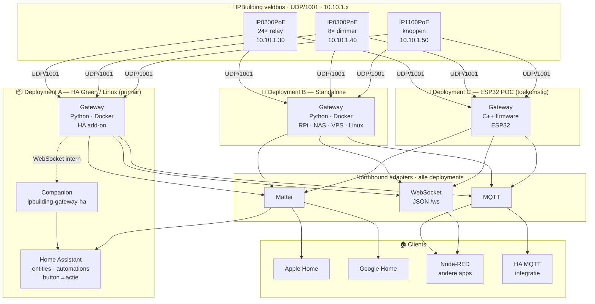
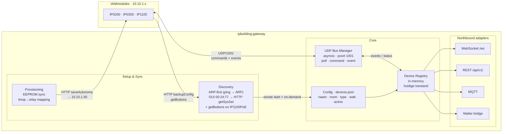
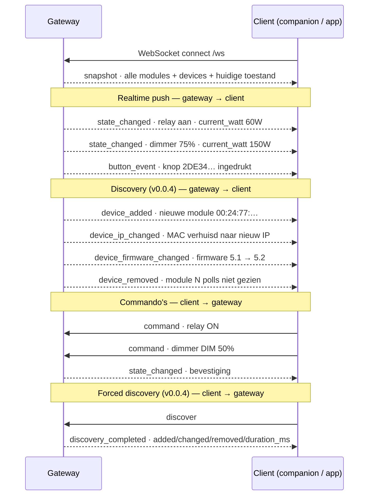
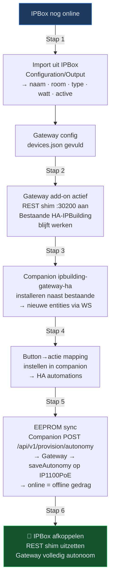

# IPBuilding Gateway — Architectuur

**Versie:** 2026-06-05 (sync §2.1/§4.1/§6/§8 met runtime auto-discovery v0.0.4 ✅)  
**Status:** Goedgekeurd (vervangt [docs/superpowers/specs/2026-05-18-gateway-architecture-design.md](docs/superpowers/specs/2026-05-18-gateway-architecture-design.md))  
**Doelgroep:** ontwikkelaars, AI-agenten, integratie-partners

---

## 1. Doelstelling & scope

De propriëtaire **IPBox** (IP0000X) vervangen door een open, zelfbeheerde gateway die:

- Rechtstreeks communiceert met IPBuilding veldcontrollers via **UDP/1001**
- Een **protocol-agnostisch northbound-API** biedt (WebSocket, MQTT, Matter)
- Installeerbaar is als **HA add-on**, als **standalone Docker-container**, of als **ESP32-firmware** (toekomstige POC)
- **Home Assistant** integreert als primaire domotica via een companion custom component

**Buiten scope:**
- IPBox REST API `:30200` nabootsen als eindproduct (enkel als tijdelijke migratie-shim)
- Sferen / scenes in de gateway (hoort in HA)
- Knop→actie automatie-logica in de gateway (hoort in de companion / HA)

---

## 2. Componenten

### 2.1 `ipbuilding-gateway` — de gateway

**Verantwoordelijkheid:** veldbus-hub + device-model. Kent devices en hun toestand. Heeft **geen automatie-logica**.

| Wat het doet | Wat het NIET doet |
|---|---|
| UDP/1001 pollen, commando's sturen, events ontvangen | Knop→actie beslissen |
| Device Registry bijhouden (huidige toestand) | HA-entities aanmaken |
| Config lezen/schrijven (naam, room, type, watt, active) | Sferen of scenes beheren |
| **Runtime auto-discovery** (init-sweep + passieve ARP-monitor + forced REST) — zie §4.1 | IPBox REST nabootsen (enkel shim, tijdelijk) |
| Northbound: WS, REST, MQTT, Matter adapters | Button-mapping opslaan |
| Provisioning: EEPROM-sync doorgeven aan input-module | — |

**Write-policy (`devices.json`) — 3 categorieën met eigen eigenaar:**

De gateway mag **nooit** impliciet beslissen om een northbound-veld te schrijven. Drie categorieën:

| Categorie | Velden in `devices.json` | Eigenaar | Gateway-gedrag |
|-----------|--------------------------|----------|----------------|
| **Noordbound (HA-domein)** | `name`, `room`, `active`, `max_watt`, `semantic_type`, kanaal-specs | Companion / gebruiker | Alleen **lezen** |
| **Fysiek (module-EEPROM)** | `backupConfig`-kanalen, button-mapping, autonomy | Module zelf (WebConfig) of gateway op expliciete `POST /api/v1/provision/autonomy` | **Nooit** impliciet schrijven |
| **Netwerk / runtime** | `ip`, `mac`, `firmware`, `last_seen`, `last_seen_source` | Gateway zelf | `ip`/`mac` in runtime-registry; `firmware` naar `devices.json` bij wijziging; `last_seen*` is runtime-only |

**Concreet:**
- Nieuwe modules (via init-sweep, passieve ARP-monitor of forced discovery) → **append** aan `devices.json` met `active: false`, `room: "Unconfigured"`, lege `channels: []`. Atomic write met lock.
- Verloren modules → enkel `unreachable: true` in runtime-registry. **Niet** verwijderen uit `devices.json`.
- IP-wijziging (DHCP) → match op MAC, update in runtime-registry, emit `device_ip_changed` WS-event. **`devices.json` `ip` blijft initieel** tot de gebruiker expliciet opslaat.
- Firmware-wijziging → één regel in `devices.json` bijgewerkt (firmware is objectief, geen split-brain risico) + `device_firmware_changed` WS event.
- Writes naar `devices.json` gaan altijd via `AtomicWriter` (tempfile + `fsync` + `os.replace` + `fcntl.flock` op `devices.json.lock`, 15 s lock-timeout).
- `last_seen` / `last_seen_source` zijn **runtime-only** velden — niet gepersisteerd naar `devices.json`; serialisatie laat ze weg (`ModuleConfig.to_dict()` filtert ze uit).

**Talen/runtimes:**
- Python 3.11+ (HA add-on en standalone Docker/RPi) — primaire implementatie
- C++ ESP-IDF (ESP32 POC) — toekomstig, zelfde northbound-protocol

### 2.2 `ipbuilding-gateway-ha` — de companion (HA custom component)

**Verantwoordelijkheid:** HA-specifieke laag. Vertaalt het gateway-protocol naar HA-entities en beheert de knop→actie-mapping.

| Wat het doet | Wat het NIET doet |
|---|---|
| WebSocket-client naar gateway `/ws` | UDP-communicatie |
| HA-entities aanmaken (light, switch, cover, button, sensor) | Provisioning rechtstreeks naar veldmodules |
| Button→actie mapping bewaren (HA config storage) | Device Registry beheren |
| "Sync naar EEPROM" triggeren via `POST /api/v1/provision/autonomy` | — |
| config_flow: auto-discovery via Supervisor of handmatig IP | — |

**Installatie:** HACS custom repository

### 2.3 Veldmodules

| Module | IP | Functie |
|---|---|---|
| IP0200PoE | 10.10.1.30 | 24× relay (aan/uit, pulse) |
| IP0300PoE | 10.10.1.40 | Dimmer (0–100%); in huidige installatie 4 kanalen in gebruik, module-capaciteit 8 |
| IP1100PoE | 10.10.1.50 | Drukknoppen — events + autonome EEPROM-mapping |

Communicatieprotocol: **UDP/1001** (binary ASCII, poort 1001). Configuratie-API: **HTTP `api.html`** rechtstreeks op elke module (backupConfig, saveOutput, saveChannel, saveAutonomy, getButtons).

---

## 3. Deployment-varianten



**Deployment A** is de primaire target: gateway als HA add-on (Docker, beheerd door HA Supervisor), companion als HACS custom component op hetzelfde device.

**Deployment B** gebruikt exact dezelfde Python-code als A, maar zonder Supervisor-wrapper. Draait als `docker run` of `python -m gateway` op elke Linux-machine (o.a. **Raspberry Pi 3B/4**). Praktisch patroon op Pi: **eth0** op IPBuilding-VLAN (`10.10.1.1`, veldbus) + **wlan0** op thuis-LAN (northbound `:8080` naar HA Green). Effort en platformvergelijking: [`resources_and_docs/reference/2026-06-14-deployment-hardware-evaluation.md`](resources_and_docs/reference/2026-06-14-deployment-hardware-evaluation.md).

**Deployment C** is een toekomstige standalone POC in C++ voor ESP32 (Fase 12). Implementeert hetzelfde northbound-protocol als A en B — de companion en andere clients werken er transparant mee. Pico W valt in dezelfde embedded categorie (C++ firmware, W5500 voor veldbus); zie evaluatie-doc hierboven.

---

## 4. Interne architectuur van de gateway



### Module-beschrijvingen

| Module | Bestand | Verantwoordelijkheid |
|---|---|---|
| `udp_bus.py` | `gateway/udp_bus.py` | asyncio UDP socket; polling (2s), command send, event listen |
| `device_registry.py` | `gateway/device_registry.py` | In-memory state van alle devices; update bij elk event |
| `installation.py` | `gateway/installation.py` | Laadt en valideert `devices.json`; levert entity-IDs; runtime-only `last_seen*` |
| `discovery.py` | `gateway/discovery.py` | ARP-sweep → OUI 00:24:77 filter → HTTP getSysSet/getButtons; configureerbare range; no ipbox_id |
| `auto_discovery.py` | `gateway/auto_discovery.py` | **Runtime auto-discovery (v0.0.4):** `ArpMonitor`, `DiscoveryOrchestrator`, `AtomicWriter` — init-sweep, passieve ARP-monitor, forced REST |
| `module_metadata.py` | `gateway/module_metadata.py` | Cache van `getSysSet`/`getButtons` per module; refresh via `POST /api/v1/modules/refresh` |
| `gateway_api.py` | `gateway/gateway_api.py` | aiohttp server: WS `/ws` + REST `/api/v1/` (incl. `POST /api/v1/discover`) |
| `rest_shim.py` | `gateway/rest_shim.py` | IPBox-compatibele REST `:30200` *(tijdelijk, transitie)* |
| `payloads/` | `gateway/payloads/` | encode/decode relay, dimmer, input — **aanwezig en getest** |

### 4.1 Module discovery — ARP-first + runtime auto-discovery (v0.0.4)

**Geïmplementeerd in:** [`gateway/auto_discovery.py`](gateway/auto_discovery.py) (commit `2407f32`, design goedgekeurd [`docs/superpowers/specs/2026-06-04-runtime-auto-discovery-design.md`](docs/superpowers/specs/2026-06-04-runtime-auto-discovery-design.md)).

**Drie modi achter één component (`DiscoveryOrchestrator`):**

| Modus | Trigger | Doel |
|-------|---------|------|
| **Init ARP-sweep** | Lege `devices.json` bij start (of `auto_discover_on_start: true`) | Eerste vulling van de installatie vanuit de veldbus |
| **Passieve ARP-monitor** | Continu tijdens runtime (default elke 30 s) | Nieuwe, gewijzigde of verdwenen modules detecteren |
| **Geforceerde discovery** | `POST /api/v1/discover` of WS-bericht `{"type": "discover"}` | Operator-actie, negeert de mode-toggles |

**Init-sweep** (eenmalig bij lege `devices.json` of `auto_discover_on_start: true`):

```
Empty devices.json detected at startup
  → ARP ping-sweep over discovery_subnet/range (default 10.10.1.0–254)
  → parse /proc/net/arp (Linux) of arp -an (macOS fallback)
  → filter OUI 00:24:77
  → HTTP getSysSet + backupConfig per candidate
  → write devices.json with active:false, room:"Unconfigured", channels:[]
  → broadcast device_added per nieuwe module
```

**Passieve ARP-monitor** (altijd aan tenzij `passive_arp_monitor: false`):

```
Every arp_poll_interval_s (default 30 s):
  → read kernel ARP table
  → diff tegen vorige snapshot
  → nieuwe MAC (OUI 00:24:77, niet in devices.json) → device_added WS event
  → bestaande MAC op ander IP → device_ip_changed WS event
  → bestaande MAC N polls niet gezien (default N=3, ~90 s) → device_removed WS event
  → GEEN write naar devices.json (runtime-only events)
```

Geen HTTP `getSysSet` calls tijdens passieve monitoring — firmware check gebeurt enkel op init/forced discovery (backlog-item voor v2).

**Geforceerde discovery** (`POST /api/v1/discover` of `{"type": "discover"}` over WS):

```
Run ongeacht de toggles
  → ARP-sweep + HTTP getSysSet + backupConfig (alle modules)
  → nieuwe modules geschreven naar devices.json (active:false)
  → firmware-wijziging → devices.json updated + device_firmware_changed WS event
  → IP-wijziging → runtime-registry updated + device_ip_changed WS event
  → return {ok, added, changed, removed, duration_ms}
```

**ARP-bron — gekozen aanpak:** `/proc/net/arp` rechtstreeks (Linux, al geïmplementeerd in `gateway/discovery.py::parse_arp_table`); `arp -an` als macOS-fallback voor ontwikkelaars. Geen netlink/pyroute2 dependency — overkill bij 30 s polling.

**OUI-filter:**

| OUI | Apparaat |
|-----|----------|
| `00:24:77` | Veldmodule (relay / dimmer / input) |
| `00:30:18` | IPBox hub — **uitsluiten** van discovery |

**Standaard range:** `10.10.1.0–254` (volledige /24 bij init) — gebruiker configureert `discovery_subnet`, `discovery_range_start`, `discovery_range_end` (HA add-on options of CLI `--range-start`/`--range-end`).

**Type/firmware:** HTTP `getSysSet` + `backupConfig` op elke ARP-gevonden module.
Type: `devtype`, dan `getSysSet` `name` of `butLines` → input, anders `backupConfig` `device.refNr` → `_MODEL_TO_TYPE` (`IP0200PoE` → relay, `IP0300PoE` → dimmer, `IP1100PoE` → input).
Firmware via `firm`/`firmware` (indien in getSysSet).
`model` en `mac` uit getSysSet; kanaallabels (`name`/`room`) uit `backupConfig` `channels[]` (relay/dimmer). CLI: `--no-backup-config` om alleen getSysSet te gebruiken.

**UDP/10001:** secundair, GO-B verdict (geen betrouwbare replies op huidige POV).

**Atomic write:** `AtomicWriter` klasse in `gateway/auto_discovery.py`:
1. Schrijf naar `<file>.tmp` in dezelfde directory
2. `fsync()` op de file-descriptor
3. `os.replace(tmp, final)` — atomaire rename op POSIX
4. Exclusive `fcntl.flock` op `<file>.lock` (15 s timeout, daarna ERROR + skip)

De companion leest `devices.json` nooit rechtstreeks; alle reads gaan via REST/WS. Lock is enkel bedoeld om gateway-interne races te voorkomen (init-sweep + passieve monitor kort na elkaar).

**Edge case — `hub_ip` buiten `discovery_subnet`:** gateway logt één WARNING bij start, geen auto-actie. Gebruiker moet `discovery_subnet` aanpassen of `POST /api/v1/discover` aanroepen.

**Configuratie (HA add-on):**

```yaml
options:
  discovery_subnet: 10.10.1          # eerste 3 octetten
  discovery_range_start: 0           # default 0 ipv 30; ARP-sweep over hele /24
  discovery_range_end: 254
  auto_discover_on_start: false      # expliciet false; init-trigger doet het alsnog bij lege config
  passive_arp_monitor: true          # default aan
  arp_poll_interval_s: 30            # default 30 s
  http_timeout_s: 2.0                # identify timeout
```

**CLI (discovery scratch-test):**

```bash
python -m gateway.discover --range-start 30 --range-end 59
python -m gateway.discover --range-start 1 --range-end 254
python -m gateway.discover --no-arp   # fallback: enkel HTTP-sweep
```

**Evidence:**
- [2026-06-03 ARP discovery spike](resources_and_docs/evidence/2026-06-03_arp_discover_spike.md) — veldtest bevestigt `.30/.40/.50` via ARP in ~20 s over /24.
- [2026-06-03 discovery scratch runbook](resources_and_docs/workflows/2026-06-03_discovery_scratch_test_runbook.md) — end-to-end validatie van pure discovery naar werkende gateway + companion.
- [2026-06-04 runtime auto-discovery design spec](docs/superpowers/specs/2026-06-04-runtime-auto-discovery-design.md) — volledig design, write-policy, edge cases.

**ESP32 (toekomstig, zie §12):** zelfde algoritme via lwIP `etharp_query()` per richtingsverkeer — geen `arp-scan` of mDNS nodig voor IPBuilding-modules.

---

## 5. Config-datamodel (`devices.json`)

De gateway bewaart een persistente config met alle metadata die de veldbus zelf niet kent. Aangemaakt via Discovery bij eerste start; daarna bewaard en on-demand bijgewerkt.

```jsonc
{
  "modules": [
    {
      "ip": "10.10.1.30",
      "type": "relay",              // relay | dimmer | input
      "model": "IP200PoE",          // factory product label uit getSysSet; optioneel
      "firmware": "5.1",            // gelezen via getSysSet bij Discovery; bewaard voor diagnostiek
      "channels": [
        {
          "ch": 0,
          "name": "2e SlpK L",      // uit IPBox Configuration/Output of handmatig
          "room": "2e verd",        // uit IPBox groep of module backupConfig
          "semantic_type": "light", // light | fan | cover | switch | plug
          "active": true,           // false = niet pollen, niet exposen
          "max_watt": 60            // theoretisch maximum (configureerbaar)
        }
      ]
    },
    {
      "ip": "10.10.1.40",
      "type": "dimmer",
      "firmware": "5.4",
      "channels": [
        {
          "ch": 0,
          "name": "Woonkamer",
          "room": "Woonkamer",
          "semantic_type": "light",
          "active": true,
          "max_watt": 200
        }
      ]
    },
    {
      "ip": "10.10.1.50",
      "type": "input",
      "firmware": "5.2.4",
      "channels": []                // gevuld door Discovery via getButtons
    }
  ],
  "buttons": [
    {
      "id": "2DE341851900001F",      // hardware-ID van IP1100PoE
      "name": "Badkamer knop",
      "room": "1e verdieping",
      "active": true
    }
  ]
}
```

**Vermogen:**
- `max_watt` = geconfigureerde waarde (theoretisch maximum)
- `current_watt` = berekend door gateway (`max_watt × dim_level / 100`), meegegeven in elk `state_changed` event — geen apart power-event nodig

**Firmware:** het veld `firmware` per module wordt gelezen via `GET api.html?method=getSysSet` tijdens Discovery en bewaard in `devices.json`. Het wordt meegegeven in elk `device_list` event zodat clients (companion, diagnostiek-tools) de firmwareversie kennen. Wordt automatisch bijgewerkt bij elke herontdekking. Bekende versies uit RE: relay `5.1`, dimmer `5.4`, input `5.2.4` — gedrag van andere versies is onbekend; log altijd de versie bij opstart.

**Initiële import:** tijdens migratie kan `name`, `room`, `semantic_type`, `active` en `max_watt` automatisch ingeladen worden vanuit `GET /general/Configuration/Output` op de IPBox (zolang die nog online is).

---

## 6. Northbound protocol — WebSocket

Alle northbound-adapters (WS, MQTT, Matter) publiceren hetzelfde logische device-model. WebSocket is de primaire adapter voor de companion.



### Berichtformaten

```jsonc
// Gateway → client: toestandswijziging
{"type": "state_changed", "id": "10.10.1.30:0",
 "state": "on", "max_watt": 60, "current_watt": 60}

{"type": "state_changed", "id": "10.10.1.40:0",
 "state": "on", "level": 75, "max_watt": 200, "current_watt": 150}

// Gateway → client: knopgebeurtenis
{"type": "button_event", "id": "2DE341851900001F", "action": "press"}

// Gateway → client: snapshot bij verbinding (incl. firmware + last_seen per module)
{"type": "snapshot", "modules": [
  {"id": "00:24:77:52:ac:be", "ip": "10.10.1.30", "name": "IP0200PoE",
   "type": "relay", "firmware": "5.1", "last_seen": "2026-06-04T18:00:00Z",
   "last_seen_source": "arp", "is_reachable": true}
], "devices": [
  {"id": "10.10.1.30-0", "module_id": "00:24:77:52:ac:be", "module_ip": "10.10.1.30",
   "channel": 0, "name": "2e SlpK L", "room": "2e verd",
   "semantic_type": "light", "active": true, "max_watt": 60, "state": "off"},
  {"id": "10.10.1.40-0", "module_id": "00:24:77:52:9e:a8", "module_ip": "10.10.1.40",
   "channel": 0, "name": "Woonkamer", "room": "Woonkamer",
   "semantic_type": "light", "active": true, "max_watt": 200,
   "state": "on", "level": 75}
]}

// Gateway → client: discovery-events (v0.0.4)
{"type": "device_added", "id": "00:24:77:52:ac:be", "mac": "00:24:77:52:ac:be",
 "ip": "10.10.1.30", "device_type": "relay", "firmware": "5.1"}

{"type": "device_removed", "id": "00:24:77:52:ac:be", "mac": "00:24:77:52:ac:be",
 "last_seen": "2026-06-04T18:00:00Z"}

{"type": "device_ip_changed", "id": "00:24:77:52:ac:be", "mac": "00:24:77:52:ac:be",
 "old_ip": "10.10.1.30", "new_ip": "10.10.1.35"}

{"type": "device_firmware_changed", "id": "00:24:77:52:ac:be", "mac": "00:24:77:52:ac:be",
 "old_firmware": "5.1", "new_firmware": "5.2"}

{"type": "discovery_completed", "added": ["00:24:77:52:ac:be"], "changed": [],
 "removed": [], "duration_ms": 2341, "trigger": "forced"}

// Client → gateway: commando's
{"type": "command", "id": "10.10.1.30:0", "action": "ON"}
{"type": "command", "id": "10.10.1.40:0", "action": "DIM", "value": 75}
{"type": "command", "id": "10.10.1.30:0", "action": "OFF"}

// Client → gateway: forced discovery trigger (v0.0.4)
{"type": "discover"}
```

**Entity-ID formaat:** `"{module_ip}-{channel}"` — deterministisch afgeleid, nooit opgeslagen.  
Het device type is **niet** onderdeel van de ID: de gateway leidt het altijd af van de module-config (type-spoofing door clients is structureel onmogelijk).  
Voorbeeld: `"10.10.1.30-0"`, `"10.10.1.40-0"`

**Module-ID formaat** (in `device_added`/`device_removed`/…): genormaliseerde MAC `00:24:77:52:ac:be` (lowercase, colon-separated). MAC is stable, IP niet (DHCP). Idem voor `/api/v1/modules` resource.

**Discovery events zijn fire-and-forget** — geen ack van client verwacht. Sequence numbering wordt niet toegevoegd in v1 (kan later). Velden zijn bewust compact; clients doen een `GET /api/v1/modules` of wachten op de snapshot voor details.

---

## 7. Migratiepad & EEPROM-sync



### EEPROM-sync detail

De button→relay mapping voor autonoom werken (gateway offline) leeft in de **IP1100PoE** zelf. De companion bewaart de mapping in HA config storage en kan die op elk moment syncen naar de module:

```
Companion (HA) → POST /api/v1/provision/autonomy
  → Gateway → HTTP api.html?method=saveAutonomy @ 10.10.1.50
    → IP1100PoE slaat mapping op in firmware
```

**Resultaat:** als de gateway uitvalt, voert de IP1100PoE exact dezelfde acties uit als wanneer hij online is — online en offline gedrag zijn synchroon.

---

## 8. Roadmap

| Fase | Beschrijving | Status |
|---|---|---|
| **1** | UDP-protocol RE: relay, dimmer, input `B-…E` + `gateway/payloads/` | ✅ Voltooid |
| **2** | UDP Bus Manager, Device Registry, REST-shim, veldtest | ✅ Voltooid (2026-06-02) |
| **3** | WebSocket API server `gateway_api.py` + REST `/api/v1/` | ✅ Voltooid (2026-06-02) |
| **4** | Gateway als HA add-on (Dockerfile + `config.yaml` + Supervisor companion auto-discovery) | ✅ Voltooid (2026-06-04) |
| **5** | Companion `ipbuilding-gateway-ha` — entities, automations | ✅ Voltooid (2026-06-02) |
| **6** | Input-events IP1100PoE naar companion via WS | ✅ Verpakt in Fase 5 |
| **7** | Runtime auto-discovery: init-sweep + passieve ARP-monitor + forced REST + write-policy | ✅ Voltooid (2026-06-04, v0.0.4) |
| **8** | EEPROM-sync (`/api/v1/provision/autonomy`) | 🔲 Open (REST-stub aanwezig; HTTP `saveAutonomy` call nog niet geïmplementeerd) |
| **9** | MQTT adapter | 🔲 Open |
| **10** | Matter bridge | 🔲 Open |
| **11** | Cover/screen entities (relay-paren) | 🔲 Open |
| **12** | ESP32 POC (C++ firmware) — embedded Matter hub | 🔲 Design draft [`2026-07-09-embedded-ipbuilding-gateway-design.md`](docs/superpowers/specs/2026-07-09-embedded-ipbuilding-gateway-design.md); lab: ESP32-S3-ETH |
| **13** | Periodieke 24h ARP-sweep + HTTP-identify voor bestaande modules tijdens passieve monitor | 🔲 Backlog (uit de runtime-discovery spec §15) |

---

## 9. Referenties

| Document | Inhoud |
|---|---|
| [`AGENTS.md`](AGENTS.md) | Agent-brief: status, volgende acties, sprint-context |
| [`resources_and_docs/RE_STATE.md`](resources_and_docs/RE_STATE.md) | Canonieke RE-status veldbus (Fase 1 afgesloten) |
| [`resources_and_docs/IPBUILDING_KNOWLEDGE.md`](resources_and_docs/IPBUILDING_KNOWLEDGE.md) | Diepe technische kennis: module HTTP API, UDP payloads, WebConfig |
| [`resources_and_docs/reference/2026-05-17_RE_WIZARDS_PLAN.md`](resources_and_docs/reference/2026-05-17_RE_WIZARDS_PLAN.md) | IPBox provisioning-RE: saveOutput, saveAutonomy, FlashAutonomyToModule |
| [`resources_and_docs/2026-05-17_ipbuilding_fieldbus_capability_matrix.md`](resources_and_docs/2026-05-17_ipbuilding_fieldbus_capability_matrix.md) | Veldbus capabilities (northbound-agnostisch) |
| [`gateway/`](gateway/) | Huidige implementatie (Fase 1 + 2 + 3 + 4 + 7) |
| [`docs/architecture-diagrams.html`](docs/architecture-diagrams.html) | Gerenderde diagrammen (lokale browser) |
| [`resources_and_docs/evidence/2026-06-03_arp_discover_spike.md`](resources_and_docs/evidence/2026-06-03_arp_discover_spike.md) | ARP-first discovery spike: OUI 00:24:77, ping-sweep, veldtest |
| [`docs/superpowers/specs/2026-06-04-runtime-auto-discovery-design.md`](docs/superpowers/specs/2026-06-04-runtime-auto-discovery-design.md) | Runtime auto-discovery: init-sweep + passieve ARP + forced REST + write-policy (goedgekeurd 2026-06-04) |
| [`resources_and_docs/workflows/2026-06-03_discovery_scratch_test_runbook.md`](resources_and_docs/workflows/2026-06-03_discovery_scratch_test_runbook.md) | End-to-end discovery scratch-test (pure discovery → werkende gateway + companion) |
| [`ipbuilding_gateway/CHANGELOG.md`](ipbuilding_gateway/CHANGELOG.md) | Add-on release notes (v0.0.1 alfa → v0.0.4 runtime auto-discovery) |
