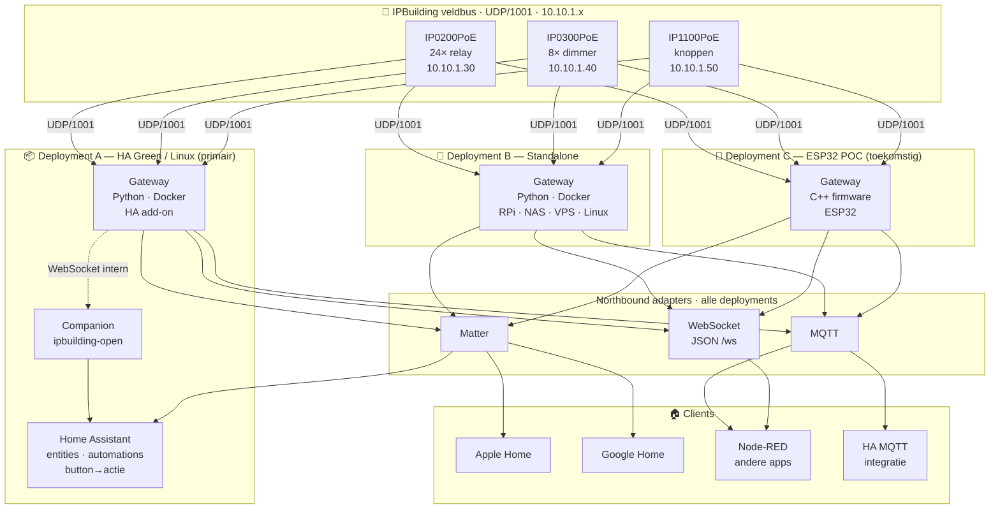
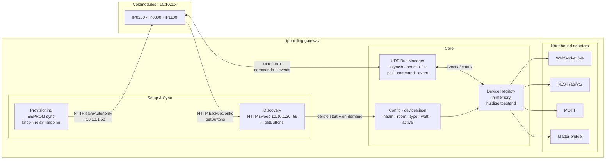
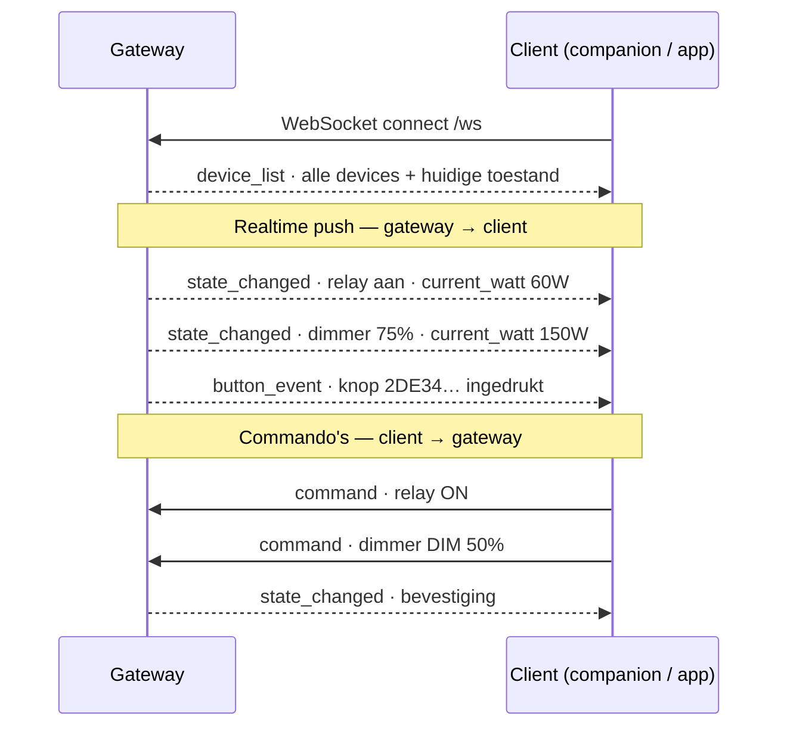
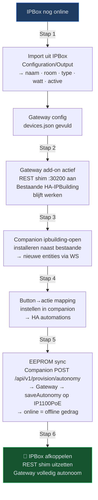

# IPBuilding Gateway — Architectuur

**Versie:** 2026-06-02  
**Status:** Goedgekeurd (vervangt [docs/superpowers/specs/2026-05-18-gateway-architecture-design.md](docs/superpowers/specs/2026-05-18-gateway-architecture-design.md))  
**Doelgroep:** ontwikkelaars, AI-agenten, integratie-partners

---

## 1. Doelstelling & scope

De propriëtaire **IPBox** (IP0000X) vervangen door een open, zelfbeheerde gateway die:

- Rechtstreeks communiceert met IPBuilding veldcontrollers via **UDP/1001**
- Een **protocol-agnostisch northbound-API** biedt (WebSocket, MQTT, Matter)
- Installeerbaar is als **HA add-on**, als **standalone Docker-container**, of als **ESP32-firmware** (toekomstige POC)
- **Home Assistant** integreert als primaire domotica via een companion custom component

**Buiten scope:**
- IPBox REST API `:30200` nabootsen als eindproduct (enkel als tijdelijke migratie-shim)
- Sferen / scenes in de gateway (hoort in HA)
- Knop→actie automatie-logica in de gateway (hoort in de companion / HA)

---

## 2. Componenten

### 2.1 `ipbuilding-gateway` — de gateway

**Verantwoordelijkheid:** veldbus-hub + device-model. Kent devices en hun toestand. Heeft **geen automatie-logica**.

| Wat het doet | Wat het NIET doet |
|---|---|
| UDP/1001 pollen, commando's sturen, events ontvangen | Knop→actie beslissen |
| Device Registry bijhouden (huidige toestand) | HA-entities aanmaken |
| Config lezen/schrijven (naam, room, type, watt, active) | Sferen of scenes beheren |
| Discovery: HTTP-sweep + `getButtons` op modules | IPBox REST nabootsen (enkel shim, tijdelijk) |
| Northbound: WS, REST, MQTT, Matter adapters | Button-mapping opslaan |
| Provisioning: EEPROM-sync doorgeven aan input-module | — |

**Talen/runtimes:**
- Python 3.11+ (HA add-on en standalone Docker/RPi) — primaire implementatie
- C++ ESP-IDF (ESP32 POC) — toekomstig, zelfde northbound-protocol

### 2.2 `ipbuilding-open` — de companion (HA custom component)

**Verantwoordelijkheid:** HA-specifieke laag. Vertaalt het gateway-protocol naar HA-entities en beheert de knop→actie-mapping.

| Wat het doet | Wat het NIET doet |
|---|---|
| WebSocket-client naar gateway `/ws` | UDP-communicatie |
| HA-entities aanmaken (light, switch, cover, button, sensor) | Provisioning rechtstreeks naar veldmodules |
| Button→actie mapping bewaren (HA config storage) | Device Registry beheren |
| "Sync naar EEPROM" triggeren via `POST /api/v1/provision/autonomy` | — |
| config_flow: auto-discovery via Supervisor of handmatig IP | — |

**Installatie:** HACS custom repository

### 2.3 Veldmodules

| Module | IP | Functie |
|---|---|---|
| IP0200PoE | 10.10.1.30 | 24× relay (aan/uit, pulse) |
| IP0300PoE | 10.10.1.40 | 8× dimmer (0–100%) |
| IP1100PoE | 10.10.1.50 | Drukknoppen — events + autonome EEPROM-mapping |

Communicatieprotocol: **UDP/1001** (binary ASCII, poort 1001). Configuratie-API: **HTTP `api.html`** rechtstreeks op elke module (backupConfig, saveOutput, saveChannel, saveAutonomy, getButtons).

---

## 3. Deployment-varianten



**Deployment A** is de primaire target: gateway als HA add-on (Docker, beheerd door HA Supervisor), companion als HACS custom component op hetzelfde device.

**Deployment B** gebruikt exact dezelfde Python-code als A, maar zonder Supervisor-wrapper. Draait als `docker run` of `python -m gateway` op elke Linux-machine.

**Deployment C** is een toekomstige standalone POC in C++ voor ESP32. Implementeert hetzelfde northbound-protocol als A en B — de companion en andere clients werken er transparant mee.

---

## 4. Interne architectuur van de gateway



### Module-beschrijvingen

| Module | Bestand | Verantwoordelijkheid |
|---|---|---|
| `udp_bus.py` | `gateway/udp_bus.py` | asyncio UDP socket; polling (2s), command send, event listen |
| `device_registry.py` | `gateway/device_registry.py` | In-memory state van alle devices; update bij elk event |
| `installation.py` | `gateway/installation.py` | Laadt en valideert `devices.json`; levert entity-IDs |
| `discovery.py` | `gateway/discovery.py` | HTTP-sweep modules; `getButtons` op IP1100PoE |
| `gateway_api.py` | `gateway/gateway_api.py` | aiohttp server: WS `/ws` + REST `/api/v1/` *(Fase 3)* |
| `rest_shim.py` | `gateway/rest_shim.py` | IPBox-compatibele REST `:30200` *(tijdelijk, transitie)* |
| `payloads/` | `gateway/payloads/` | encode/decode relay, dimmer, input — **aanwezig en getest** |

---

## 5. Config-datamodel (`devices.json`)

De gateway bewaart een persistente config met alle metadata die de veldbus zelf niet kent. Aangemaakt via Discovery bij eerste start; daarna bewaard en on-demand bijgewerkt.

```jsonc
{
  "modules": [
    {
      "ip": "10.10.1.30",
      "type": "relay",              // relay | dimmer | input
      "firmware": "5.1",            // gelezen via getSysSet bij Discovery; bewaard voor diagnostiek
      "channels": [
        {
          "ch": 0,
          "name": "2e SlpK L",      // uit IPBox Configuration/Output of handmatig
          "room": "2e verd",        // uit IPBox groep of module backupConfig
          "semantic_type": "light", // light | fan | cover | switch | plug
          "active": true,           // false = niet pollen, niet exposen
          "max_watt": 60            // theoretisch maximum (configureerbaar)
        }
      ]
    },
    {
      "ip": "10.10.1.40",
      "type": "dimmer",
      "firmware": "5.4",
      "channels": [
        {
          "ch": 0,
          "name": "Woonkamer",
          "room": "Woonkamer",
          "semantic_type": "light",
          "active": true,
          "max_watt": 200
        }
      ]
    },
    {
      "ip": "10.10.1.50",
      "type": "input",
      "firmware": "5.2.4",
      "channels": []                // gevuld door Discovery via getButtons
    }
  ],
  "buttons": [
    {
      "id": "2DE341851900001F",      // hardware-ID van IP1100PoE
      "name": "Badkamer knop",
      "room": "1e verdieping",
      "active": true
    }
  ]
}
```

**Vermogen:**
- `max_watt` = geconfigureerde waarde (theoretisch maximum)
- `current_watt` = berekend door gateway (`max_watt × dim_level / 100`), meegegeven in elk `state_changed` event — geen apart power-event nodig

**Firmware:** het veld `firmware` per module wordt gelezen via `GET api.html?method=getSysSet` tijdens Discovery en bewaard in `devices.json`. Het wordt meegegeven in elk `device_list` event zodat clients (companion, diagnostiek-tools) de firmwareversie kennen. Wordt automatisch bijgewerkt bij elke herontdekking. Bekende versies uit RE: relay `5.1`, dimmer `5.4`, input `5.2.4` — gedrag van andere versies is onbekend; log altijd de versie bij opstart.

**Initiële import:** tijdens migratie kan `name`, `room`, `semantic_type`, `active` en `max_watt` automatisch ingeladen worden vanuit `GET /general/Configuration/Output` op de IPBox (zolang die nog online is).

---

## 6. Northbound protocol — WebSocket

Alle northbound-adapters (WS, MQTT, Matter) publiceren hetzelfde logische device-model. WebSocket is de primaire adapter voor de companion.



### Berichtformaten

```jsonc
// Gateway → client: toestandswijziging
{"type": "state_changed", "id": "10.10.1.30:relay:0",
 "state": "on", "max_watt": 60, "current_watt": 60}

{"type": "state_changed", "id": "10.10.1.40:dimmer:0",
 "state": "on", "level": 75, "max_watt": 200, "current_watt": 150}

// Gateway → client: knopgebeurtenis
{"type": "button_event", "id": "2DE341851900001F", "action": "press"}

// Gateway → client: volledige lijst bij verbinding (incl. firmware per module)
{"type": "device_list", "devices": [
  {"id": "10.10.1.30:relay:0",  "name": "2e SlpK L",  "room": "2e verd",
   "semantic_type": "light", "active": true, "max_watt": 60,
   "state": "off", "firmware": "5.1"},
  {"id": "10.10.1.40:dimmer:0", "name": "Woonkamer",   "room": "Woonkamer",
   "semantic_type": "light", "active": true, "max_watt": 200,
   "state": "on", "level": 75, "firmware": "5.4"}
]}

// Client → gateway: commando's
{"type": "command", "id": "10.10.1.30:relay:0", "action": "ON"}
{"type": "command", "id": "10.10.1.40:dimmer:0", "action": "DIM", "value": 75}
{"type": "command", "id": "10.10.1.30:relay:0", "action": "OFF"}
```

**Entity-ID formaat:** `"{module_ip}:{device_type}:{channel}"` — deterministisch afgeleid, nooit opgeslagen.  
Voorbeeld: `"10.10.1.30:relay:0"`, `"10.10.1.40:dimmer:0"`

---

## 7. Migratiepad & EEPROM-sync



### EEPROM-sync detail

De button→relay mapping voor autonoom werken (gateway offline) leeft in de **IP1100PoE** zelf. De companion bewaart de mapping in HA config storage en kan die op elk moment syncen naar de module:

```
Companion (HA) → POST /api/v1/provision/autonomy
  → Gateway → HTTP api.html?method=saveAutonomy @ 10.10.1.50
    → IP1100PoE slaat mapping op in firmware
```

**Resultaat:** als de gateway uitvalt, voert de IP1100PoE exact dezelfde acties uit als wanneer hij online is — online en offline gedrag zijn synchroon.

---

## 8. Roadmap

| Fase | Beschrijving | Status |
|---|---|---|
| **1** | UDP-protocol RE: relay, dimmer, input `B-…E` + `gateway/payloads/` | ✅ Voltooid |
| **2** | UDP Bus Manager, Device Registry, REST-shim, veldtest | ✅ Voltooid (2026-06-02) |
| **3** | WebSocket API server `gateway_api.py` + REST `/api/v1/` | 🔲 Open |
| **4** | Gateway als HA add-on (Dockerfile + `config.yaml`) | 🔲 Open |
| **5** | Companion `ipbuilding-open` — entities, automations | 🔲 Open |
| **6** | Input-events IP1100PoE naar companion via WS | 🔲 Open |
| **7** | Discovery wizard + config-import vanuit IPBox | 🔲 Open |
| **8** | EEPROM-sync (`/api/v1/provision/autonomy`) | 🔲 Open |
| **9** | MQTT adapter | 🔲 Open |
| **10** | Matter bridge | 🔲 Open |
| **11** | Cover/screen entities (relay-paren) | 🔲 Open |
| **12** | ESP32 POC (C++ firmware) | 🔲 Toekomstig |

---

## 9. Referenties

| Document | Inhoud |
|---|---|
| [`AGENTS.md`](AGENTS.md) | Agent-brief: status, volgende acties, sprint-context |
| [`resources_and_docs/RE_STATE.md`](resources_and_docs/RE_STATE.md) | Canonieke RE-status veldbus (Fase 1 afgesloten) |
| [`resources_and_docs/IPBUILDING_KNOWLEDGE.md`](resources_and_docs/IPBUILDING_KNOWLEDGE.md) | Diepe technische kennis: module HTTP API, UDP payloads, WebConfig |
| [`resources_and_docs/reference/2026-05-17_RE_WIZARDS_PLAN.md`](resources_and_docs/reference/2026-05-17_RE_WIZARDS_PLAN.md) | IPBox provisioning-RE: saveOutput, saveAutonomy, FlashAutonomyToModule |
| [`resources_and_docs/2026-05-17_ipbuilding_fieldbus_capability_matrix.md`](resources_and_docs/2026-05-17_ipbuilding_fieldbus_capability_matrix.md) | Veldbus capabilities (northbound-agnostisch) |
| [`gateway/`](gateway/) | Huidige implementatie (Fase 1 + 2) |
| [`docs/architecture-diagrams.html`](docs/architecture-diagrams.html) | Gerenderde diagrammen (lokale browser) |
