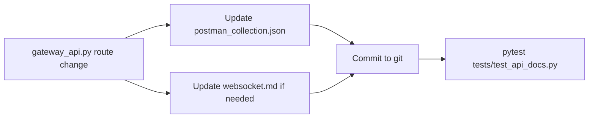

# IPBuilding Gateway API — Import Guide

REST API documentation for the IPBuilding open field-bus gateway. Import once and keep up to date via git.

---

## RapidAPI for Mac (primary)

### Import the collection

1. Open RapidAPI for Mac
2. In the Requests sidebar, click the three dots (⋮) next to **Requests**
3. Select **Import Requests**
4. Choose **Postman Collection Importer**
5. Select **Upload a File** or paste the raw file path
6. Point to `docs/api/ipbuilding-gateway.postman_collection.json` in this repository

### Import the environment

1. In RapidAPI for Mac, open **Environments** (bottom-left)
2. Click the **+** to create a new environment, or import `docs/api/environments/local.postman_environment.json` if supported
3. Set values:
   - `gateway_host` — IP of your gateway (e.g. `192.168.1.x` or `localhost`)
   - `gateway_port` — gateway API port (default `8080`)
   - `module_ip` — example relay module IP (`10.10.1.30`)
   - `channel` — channel number to test (e.g. `0`)
4. Activate the environment from the dropdown at the bottom-left

### Test the API

1. Expand **Devices** → **List devices** → press **Send**
2. You should receive a `200 OK` with a `devices` array
3. Expand **Commands** → **Relay ON** → adjust `module_ip` and `channel` in the path if needed → **Send**

### WebSocket (real-time)

WebSocket requests are not included in the collection (Postman export limitation — see [websocket.md](websocket.md)).

1. Create a new **WebSocket** request in RapidAPI for Mac
2. URL: `ws://{{gateway_host}}:{{gateway_port}}/ws`
3. Connect — the gateway sends a `device_list` snapshot immediately
4. Use the saved example messages in [websocket.md](websocket.md) to send commands

---

## GetAPI (optional)

GetAPI can import Postman Collections directly.

1. **File → Import → Postman** (or drag the JSON file onto the app)
2. Select `docs/api/ipbuilding-gateway.postman_collection.json`
3. The same requests and structure appear as in RapidAPI for Mac
4. Set environment variables manually in GetAPI's environment editor:
   - `gateway_host`, `gateway_port`, `module_ip`, `channel`, `base_url`

WebSocket support in GetAPI is documented but collection export is not yet available ([GetAPI issue #148](https://github.com/Get-API-App/Issue-Tracker/issues/148)). For real-time testing, use RapidAPI for Mac's WebSocket request.

---

## Keeping docs up to date

The Postman collection is the **single source of truth** for REST endpoint definitions. Any change to routes in `gateway_api.py` must be reflected in this collection.

### Sync workflow

### What to update when

| Change in `gateway_api.py` | Action |
|---------------------------|--------|
| New REST endpoint | Add request to `ipbuilding-gateway.postman_collection.json` |
| Removed REST endpoint | Remove request from collection |
| Changed REST path/method | Update the corresponding request |
| Changed WS message format | Update `websocket.md` |

### Re-importing after git pull

If you use the collection via **Remote URL** (raw GitHub link), delete the old import and re-import the updated Remote URL after `git pull`.

---

## Out of scope

- **Postman v1.0 format** — not used; v2.1 is the standard
- **GetAPI native folder tree** — not managed in this repo; use the Postman import instead
- **Gateway-served OpenAPI** (`GET /openapi.json`) — REST docs live in git, not served by the gateway
- **AsyncAPI YAML for WebSocket** — `websocket.md` is sufficient for PAW/GetAPI manual setup
- **Newman collection runner in CI** — only the contract test (`tests/test_api_docs.py`) validates parity

---

## Files

| File | Purpose |
|------|---------|
| [`ipbuilding-gateway.postman_collection.json`](ipbuilding-gateway.postman_collection.json) | REST requests, v2.1 |
| [`environments/local.postman_environment.json`](environments/local.postman_environment.json) | Environment variables |
| [`websocket.md`](websocket.md) | WebSocket message catalog and PAW setup |
| [`discovery.md`](discovery.md) | CLI reference for all discovery tools |
| [`tests/test_api_docs.py`](../../tests/test_api_docs.py) | Contract test (runs in CI) |

For architecture context, see [`ARCHITECTURE.md`](../../ARCHITECTURE.md) §6 (WebSocket) and §5 (REST API).