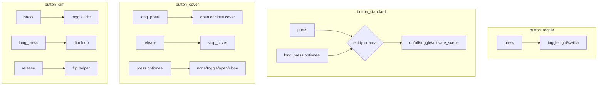

# IPBuilding wandknop blueprint-set — design spec

**Datum:** 2026-06-18
**Type:** Design spec (companion-side uitbreiding van Fase 5)
**Status:** Approved (2026-06-18)
**Scope:** companion (`ipbuilding-gateway-ha`); gateway-side impact is alleen de cutover-doc die de nieuwe blueprint-namen noemt.

---

## 1. Doel

De companion levert vandaag één blueprint ([`dim_button.yaml`](../../ipbuilding-gateway-ha/custom_components/ipbuilding_gateway_ha/blueprints/automation/ipbuilding_gateway_ha/dim_button.yaml)) die twee use-cases mixt: lampen schakelen en dimmen tijdens hold. Daardoor:

1. Een operator die alleen een lamp wil togglen moet verplicht een `input_boolean` `direction_helper` aanmaken, anders kan de blueprint niet geïnstantieerd worden.
2. De blueprint is niet duidelijk genoeg voor verschillende patronen (gordijn met hold+stop, scene-activering, area-acties).
3. `max: 1` in combinatie met `mode: restart` is ongeldig volgens HA-core en geeft `value must be at least 2 @ data['max']` bij het opslaan.
4. Een update van de companion bereikt bestaande HA-installs niet: `async_install_packaged_blueprints` ([`blueprints.py`](../../ipbuilding-gateway-ha/custom_components/ipbuilding_gateway_ha/blueprints.py)) kopieert alleen ontbrekende bestanden.

**Doel van deze iteratie:** vier doelgerichte blueprints, een P0-fix op de dim-blueprint, en versioned sync zodat updates bestaande installs bereiken.

---

## 2. Scope

| In scope | Buiten scope (nu) |
|----------|-------------------|
| `button_toggle.yaml` | `button_advanced.yaml` (action-selector) |
| `button_standard.yaml` (press + optionele long_press; entity + area) | Hold-drempel in blueprint |
| `button_cover.yaml` (hold + release stop; cover only) | Laag 3: operator README-migratie-instructies |
| `button_dim.yaml` (dim-logica, gefixt) | Laag 4: repair issue (later) |
| Fix `max: 1` + helper UX | |
| Laag 1+2: versioned sync + bestandsnamen | |

---

## 3. Blueprint-keuze (operator)

| Situatie | Blueprint |
|----------|-----------|
| Eén tik, lamp aan/uit | `button_toggle` |
| Kort + lang, verschillende lampen/scenes/area | `button_standard` |
| Gordijn: vasthouden = bewegen, loslaten = stop | `button_cover` |
| Lamp dimmen tijdens hold | `button_dim` |
| Vrije acties (script, notify, …) | later `button_advanced` |

---

## 4. Architectuur



### Gemeenschappelijke inputs (alle blueprints)

| Input | Doel |
|-------|------|
| `automation_name` | `alias` |
| `automation_area` | `area_id` op de automatisering |
| `button_entity` | Event-entity (`ipbuilding_gateway_ha`, domain `event`) |

### 4.1 `button_toggle.yaml`

- Trigger: alleen `press`
- Target: `light`, `switch`
- Actie: `*.toggle`
- Geen long_press, geen release

### 4.2 `button_standard.yaml`

**Doel:** lampen, relays, scenes, area-lampen. Geen cover, geen release-trigger.

Twee fasen: press (verplicht) + long_press (optioneel, default `none`).

**GUI:** collapsed sectie voor long_press:

```yaml
press_section:
  name: Korte druk
  input:
    press_action:        # on | off | toggle | activate_scene
    press_target_kind:   # entity | area
    press_entity_target: # light, switch, scene
    press_area:

long_press_section:
  name: Lang indrukken (optioneel)
  collapsed: true
  input:
    long_press_action:   # default: none
    long_press_target_kind: ...
    long_press_entity_target: ...
    long_press_area: ...
```

Triggers: `press`, `long_press`. `mode: single`.

**Acties:**

| Actie | light/switch | scene | area (light.*) |
|-------|-------------|-------|----------------|
| `none` | skip | skip | skip |
| `on` | turn_on | — | light.turn_on |
| `off` | turn_off | — | light.turn_off |
| `toggle` | toggle | — | light.toggle |
| `activate_scene` | — | scene.turn_on | skip |

Entity domains: `light`, `switch`, `scene`. Geen `cover`.

### 4.3 `button_cover.yaml`

**Doel:** hold/release-patroon voor `cover`-entities (gordijn, screen). Fase 11 companion-dekking kan later volgen; de blueprint werkt met elke bestaande HA `cover`-entity.

**Kern-gedrag:**

- **long_press** (default: `open`) → `cover.open_cover` of `cover.close_cover`
- **release** (default: `stop`) → `cover.stop_cover`
- **press** (optioneel, default: `none`) → geen actie, of toggle/open/close

`release` vuurt bij **elke** loslating (zie [`event.py`](../../ipbuilding-gateway-ha/custom_components/ipbuilding_gateway_ha/event.py) L39–40). In deze blueprint is dat gewenst — description legt het hold+stop-patroon uit.

**GUI:**

```yaml
# Open
automation_name, button_entity, automation_area
cover_entity:          # entity selector, domain: cover, required

hold_section:
  name: Vasthouden
  input:
    hold_direction:    # select: open | close  (default: open)

release_section:
  name: Loslaten
  input:
    release_action:    # select: stop | none  (default: stop)

press_section:
  name: Korte druk (optioneel)
  collapsed: true
  input:
    press_action:      # none | toggle | open | close  (default: none)
```

Triggers: `press`, `long_press`, `release`. `mode: single`.

**Standaardpatroon:** hold = open, release = stop, press = none.

### 4.4 `button_dim.yaml`

Hernoemd van `dim_button.yaml`. **Fix:** verwijder `max: 1`; behoud `mode: restart`. Helper-UX-tekst (naam vs entity ID). `release` hier alleen voor direction-helper flip (ongewijzigd).

### 4.5 Deprecation `dim_button.yaml`

Stub met `[VEROUDERD]`-naam + description die naar `button_dim.yaml` verwijst. Voorkomt broken automations die nog `dim_button.yaml` refereren.

---

## 5. Blueprint-sync (laag 1 + 2)

Probleem: `async_install_packaged_blueprints` kopieert alleen ontbrekende bestanden en draait maar één keer per HA-sessie (zie [`blueprints.py`](../../ipbuilding-gateway-ha/custom_components/ipbuilding_gateway_ha/blueprints.py) regel 22, 28, 62). Updates bereiken bestaande installs niet.

### 5.1 Versioned sync

1. Elke packaged blueprint krijgt header-comment: `# ipbuilding_blueprint_version: N`.
2. `async_install_packaged_blueprints` uitbreiden:
   - Kopieer als dest ontbreekt.
   - **Of** package-versie > dest-versie → overschrijf.
   - **Of** dest bevat `# user_modified: true` → skip + log warning.
3. Na wijziging: `async_get_blueprints(hass).async_reset_cache()`.
4. Sync draait niet meer gecached via `_BLUEPRINTS_SYNCED_KEY`, maar wordt per entry-setup uitgevoerd (de flag wordt vervangen door een bestandsnaam→hash-kaart in `hass.data` die per upgrade wordt vergeleken).

### 5.2 Tests

[`test_blueprints.py`](../../ipbuilding-gateway-ha/tests/test_blueprints.py) uitbreiden:

- Upgrade wanneer package-versie hoger
- Skip wanneer `user_modified: true`
- Nieuwe bestanden worden nog steeds gekopieerd

---

## 6. HA-validatie (skills)

- Triggers: state op event-entity (`entity_id` boven device_id) — conform [`home-assistant-best-practices`](../../.agents/skills/home-assistant-best-practices/SKILL.md).
- Dim: `mode: restart`, **geen** `max`.
- Services: `target:`-structuur; geen templates in device actions.
- `activate_scene` = native `scene.turn_on`.

---

## 7. Bestanden (companion repo)

| Bestand | Actie |
|---------|-------|
| `blueprints/automation/ipbuilding_gateway_ha/button_toggle.yaml` | Nieuw |
| `blueprints/automation/ipbuilding_gateway_ha/button_standard.yaml` | Nieuw |
| `blueprints/automation/ipbuilding_gateway_ha/button_cover.yaml` | Nieuw |
| `blueprints/automation/ipbuilding_gateway_ha/button_dim.yaml` | Nieuw (van dim_button) |
| `blueprints/automation/ipbuilding_gateway_ha/dim_button.yaml` | Deprecation-stub |
| `custom_components/ipbuilding_gateway_ha/blueprints.py` | Versioned sync |
| `tests/test_blueprints.py` | Sync + smoke tests |
| `CHANGELOG.md` | Release notes |
| `custom_components/ipbuilding_gateway_ha/README.md` | Blueprint-lijst bijwerken |

Gateway repo: korte update in [`2026-06-17_button_long_press_cutover.md`](../../resources_and_docs/reference/2026-06-17_button_long_press_cutover.md) stap 8 (blueprint-namen).

---

## 8. Implementatievolgorde

1. **P0** — `button_dim.yaml` + sync + tests
2. **P1** — `button_toggle.yaml`
3. **P1** — `button_standard.yaml` (zonder cover/release)
4. **P1** — `button_cover.yaml`
5. **P2** — `dim_button.yaml` stub, CHANGELOG, README

---

## 9. Later (expliciet uitgesteld)

- `button_advanced.yaml` — action-selector
- Repair issue (laag 4)
- `switch.*` op area-target in standard
- Companion `cover` platform (fase 11)
