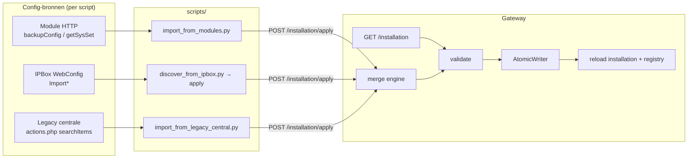

# Installation API + externe import-scripts — design spec

**Datum:** 2026-07-03  
**Type:** Design spec (provisioning / `devices.json`)  
**Status:** Draft — merge policy **A** goedgekeurd (2026-07-03); review tegen codebase (2026-07-03)  
**Scope:** gateway northbound API + `scripts/` import-tools. Companion-integratie is sketched in §8; implementatie in `ipbuilding-gateway-ha` is een aparte workstream.

**Context:** Legacy IPBuilding-centrale (IP0000) en IPBox-installaties hebben projectconfig in respectievelijk `ipcom.mdb` / WebConfig. Module-HTTP discovery (`POST /api/v1/discover`) vindt fysieke modules maar levert niet altijd de logische mapping (namen, groepen) zoals de gebruiker die in de mobile UI ziet. Import-scripts per scenario + één dunne gateway-API houden de gateway vrij van scenario-specifieke logica.

**Gerelateerd:** `ARCHITECTURE.md` §2.1 write-policy · `2026-06-04-runtime-auto-discovery-design.md` · `scripts/discover_from_ipbox.py` · `reference/legacy-ipbox-webservice/actions.php`

---

## 1. Doel

1. **Lees- en schrijftoegang** tot `devices.json` via een stabiele REST-API (niet via losse bestandsbewerking op `/config`).
2. **Externe import-scripts** per migratie-/provisioning-scenario die JSON produceren en via de API toepassen.
3. **Gateway blijft dun:** validatie, atomic write, reload — geen HTML-scraping of IPBox-cookies in `gateway/`.
4. **Merge policy A:** import overschrijft **nooit** bestaande northbound-velden (`name`, `room`, `active`, `max_watt`, `semantic_type`) die de companion of gebruiker al heeft gezet.

**Niet in scope:**

- Volledig CRUD op losse resources (`DELETE /modules/{id}`).
- Importlogica in de companion (companion triggert alleen de API of bundled scripts).
- Vervanging van `POST /api/v1/discover` (blijft veldbus-discovery via ARP + module-HTTP).
- Authenticatie/autorisatie op de installation-API (zelfde vertrouwensmodel als overige gateway-REST: LAN/add-on intern).

---

## 2. Probleem (veldgeval)

Bij legacy-centrale-installaties:

- `POST /api/v1/discover` kan modules missen of `devices.json` schrijven zonder succesvolle reload (bijv. ongeldig `type: unknown`).
- Projectnamen en ip+ch-mapping zitten in de **centrale** (`Componenten` via `actions.php`), niet in module-`backupConfig`.
- `discover_from_ipbox.py` vereist IPBox WebConfig — niet beschikbaar op IP0000.

Oplossing: installation-API als enkel schrijfpad + nieuw script `import_from_legacy_central.py` (en bestaande IPBox-script hergebruikt dezelfde API).

---

## 3. Architectuur



**Scheiding:**

| Laag | Verantwoordelijkheid |
|------|---------------------|
| Gateway | Schema-validatie, merge policy, atomic write, reload, `POST /discover` |
| Scripts | Bron-specifieke extractie → `devices.json`-schema |
| Companion | Operator-UX, services, bewaart northbound na eerste import |

---

## 4. REST API

Base: bestaande `gateway_api.py` (aiohttp) op `/api/v1/`.

### 4.1 `GET /api/v1/installation`

Retourneert de **persisted** installatie (inhoud van `devices.json`), niet runtime state.

```json
{
  "modules": [
    {
      "name": "IP0200PoE",
      "model": "IP0200PoE",
      "ip": "10.10.1.32",
      "type": "relay",
      "mac": "00:24:77:…",
      "firmware": "5.1",
      "channels": [
        {
          "ch": 0,
          "name": "Verlichting garage",
          "room": "Verlichting",
          "semantic_type": "light",
          "active": true,
          "max_watt": 60
        }
      ]
    }
  ],
  "buttons": [
    {
      "id": "1100-01",
      "name": "Keuken links",
      "hold_threshold_s": 0.5
    }
  ]
}
```

- Geen `last_seen` / `last_seen_source` (runtime-only).
- `buttons[]` (top-level) wordt **altijd** teruggegeven — IP1100PoE-inputs staan hier,
  niet onder `channels`. `channels` blijft `[]` voor input-modules. Zie §5.5.
- Optioneel query `?include_validation=true` voor warnings (lege kanalen, ontbrekende MAC).

### 4.2 `POST /api/v1/installation/validate`

Dry-run: zelfde body als `apply`, geen schrijven.
Validatie hergebruikt de bestaande `InstallationConfig._parse(raw)` (dict-in): schema,
duplicate MAC/IP en duplicate `device_id` worden daar al afgedwongen.

**Response 200:**

```json
{
  "ok": true,
  "errors": [],
  "warnings": ["module 10.10.1.55: no channels"],
  "preview": { "modules_added": 2, "modules_updated": 1, "channels_added": 24 }
}
```

**Response 422:** `ok: false`, `errors` met parse-/schema-fouten (bijv. `Unknown module type 'unknown'`).

### 4.3 `POST /api/v1/installation/apply`

**Request body:**

```json
{
  "mode": "merge_modules",
  "modules": [ … ],
  "buttons": [ … ]
}
```

| `mode` | Gedrag |
|--------|--------|
| `replace` | Volledige vervanging na validatie. Lege `modules: []` toegestaan (reset). |
| `merge_modules` | Match bestaande modules op **MAC** (primair) of **IP** (fallback). Zie §5. |
| `append_modules` | Alleen modules toevoegen waarvan MAC/IP nog niet bestaat; bestaande ongemoeid. |
| `import_channels` | Alleen kanaallijsten mergen binnen bestaande modules; geen nieuwe modules. |

**Response 200:**

```json
{
  "ok": true,
  "applied": { "modules": 3, "channels": 28 },
  "reload": true
}
```

Na succesvolle apply:

1. `AtomicWriter` → `devices.json`
2. Re-validatie via `InstallationConfig._parse()` / `load()` — bij falen: **geen** partial runtime state; oude installatie blijft actief + error in response
3. Hergebruik de bestaande callback `on_installation_changed` (`main.py:142` → `_apply_installation`, zelfde pad als discovery in `auto_discovery.py:517`): registry, metadata refresh, WS `discovery_completed` of nieuw `installation_changed`
4. Log: `applied installation: N modules` (expliciet, geen mismatch “written 1 / applied 0” zonder error)

### 4.4 Afscheiding van bestaande endpoints

| Endpoint | Doel |
|----------|------|
| `GET /api/v1/devices` | Logische kanalen + **live state** (product-API) |
| `GET /api/v1/installation` | **Persisted config** (provisioning) |
| `POST /api/v1/discover` | Veld-bus auto-discovery (intern → apply met `append_modules` + netwerkvelden) |

---

## 5. Merge policy A (goedgekeurd)

### 5.1 Veld-categorieën

| Categorie | Velden | Bij `merge_modules` / `import_channels` |
|-----------|--------|------------------------------------------|
| **Northbound** | `name`, `room`, `active`, `max_watt`, `semantic_type`, kanaal-specs | **Behoud bestaand** als kanaal/module al bestaat |
| **Netwerk** | `ip`, `mac`, `firmware`, `model` | Update vanuit import als import waarde levert |
| **Shim-only** | `ipbox_id`, `id` (device_id) | Vullen als leeg; nooit wissen (stabiele entity-id) |
| **Nieuw** | Module of kanaal niet in huidige config | Northbound uit import; default `active: false`, `room: "Unconfigured"` als import geen waarde heeft |
| **Buttons** | top-level `buttons[]` (IP1100) | Zie §5.5 — behoud bestaand, nooit impliciet wissen |

### 5.2 Match-regels

**Module:**

1. `mac` genormaliseerd via bestaande `_normalize_mac()` (lowercase, colons) — primair
2. Anders `ip` — fallback (DHCP-installaties zonder MAC in import)

**Kanaal:**

1. `(module_ref, ch)` — `ch` integer

### 5.3 Pseudocode

```
for each imported_module:
  existing = find_by_mac_or_ip(imported_module)
  if existing:
    update existing.ip, .mac, .firmware, .model from import (if present)
    for each imported_channel:
      ec = find_channel(existing, ch)
      if ec:
        # policy A: skip northbound fields on ec
        fill only if ec.field is empty/default and import has value
      else:
        append channel with import northbound (active default false)
  else:
    append module (active false on channels unless import specifies)
```

**Leeg = overschrijfbaar:** `name` gelijk aan `ip` of `""`; `room` `""` of `"Unconfigured"`; `active` alleen default bij nieuw kanaal.

### 5.4 `replace` mode

Geen merge — volledige vervanging. Operator/script expliciet. Companion zou dit alleen via bevestigde UI mogen aanbieden.

### 5.5 Buttons (top-level `buttons[]`)

IP1100PoE-inputs worden **niet** als kanalen opgeslagen maar in de top-level `buttons[]`
array (`installation.py`: `raw.get("buttons", [])`). `hold_threshold_s` en event-routing
zijn hier authoritative.

- `merge_modules` / `import_channels` / `append_modules`: **buttons ongemoeid** — bestaande
  `buttons[]` blijft integraal behouden, ook als de import ze niet levert.
- `replace`: als de body geen `buttons[]` bevat, worden bestaande buttons **behouden**
  (geen impliciet wissen). Alleen een expliciete `"buttons": []` reset ze.
- Volledige button-import uit de legacy centrale is v1 out of scope (§12).

---

## 6. Import-scripts (`scripts/`)

Gemeenschappelijk patroon:

```bash
# 1. Extract → stdout of bestand
python -m scripts.import_from_legacy_central \
  --central-host 10.10.1.1 \
  --output devices.import.json

# 2. Apply via gateway API
python -m scripts.apply_installation \
  --gateway http://127.0.0.1:8080 \
  --mode merge_modules \
  --file devices.import.json
```

Of één stap: `--apply http://127.0.0.1:8080`.

### 6.1 Script-inventaris

| Script | Bron | Status |
|--------|------|--------|
| `POST /discover` (orchestrator) | Module HTTP + ARP | Bestaat; refactor naar `apply` API. Optionele CLI-wrapper `import_from_modules.py` is **Nieuw** |
| `discover_from_ipbox.py` | IPBox WebConfig | Bestaat; refactor apply-pad |
| `import_from_legacy_central.py` | `actions.php` `searchItems` / `showGroupItems*` | **Nieuw** |
| `apply_installation.py` | JSON-bestand → POST API | **Nieuw** (shared helper) |

### 6.2 `import_from_legacy_central.py`

- **Input:** `--central-host` (default `10.10.1.1`), optioneel `--group` (alleen `showGroupItems`).
- **HTTP:** `GET …/mobile/core/actions.php?methode=searchItems&searchStr=` (lege string → `LIKE '%%'`).
- **Parse:** HTML uit `ComponentenModel` — fixtures in `tests/fixtures/legacy_central/` (snapshot HTML uit veld).
- **Mapping `Modula` → `type`:** 1=dimmer, relay=overige output (zie legacy-analyse); input-knoppen via prefix `B` in `Adres` → aparte `buttons[]` of skip in v1.
- **`Adres`:** `10.10.1.32-00` → module IP + channel index.
- **URL-decode:** velden uit de centrale/IPBox kunnen encoding-artefacten bevatten
  (bv. `"Slaapkamers 2e%20verdieping"`); `name`/`room` moeten URL-gedecodeerd worden.
- **Output:** `devices.json`-schema; `active: false` op nieuwe kanalen.

**Netwerk:** script moet draaien waar `10.10.1.1` bereikbaar is (add-on container, niet thuis-LAN laptop).

### 6.3 Foutafhandeling scripts

- Exit `0` success, `1` extract-fout, `2` validate/apply 422, `3` gateway onbereikbaar.
- Altijd eerst `validate` optioneel via `--dry-run`.

---

## 7. Gateway-interne fixes (zelfde release)

Los van de API, om het veldgeval te dichten:

1. **`type: unknown`:** wordt al geweigerd in `_parse` (`DeviceType(...)` → `InstallationError`). Echte fix: **discovery mag pas persisteren nadat `_parse` slaagt** — nu kan discovery naar disk schrijven vóór validatie.
2. **Reload-fout:** als `AtomicWriter` slaagt maar `load()` faalt → response `ok: false`, runtime ongewijzigd, error gelogd (geen stille “0 modules applied”).
3. **`POST /discover` refactor:** intern `append_modules` + merge policy i.p.v. ad-hoc list rebuild — één code-pad met `apply`.

---

## 8. Companion (later)

| Feature | Mechanisme |
|---------|------------|
| Config import knop | Service `ipbuilding.apply_installation` → POST API |
| Legacy centrale | Service roept add-on script aan of gateway bundled runner |
| Ontdekken | Bestaand `POST /discover` / toekomstige `ipbuilding.discover` |

Companion bewaart northbound na eerste entity-setup; herimport met policy A is veilig.

---

## 9. Testplan

| Test | Type |
|------|------|
| `validate` weigert `type: unknown` | unit |
| merge A: bestaande `name` blijft | unit |
| merge: nieuw kanaal krijgt import-naam | unit |
| `apply` + reload → registry module count | integration |
| legacy HTML fixture → expected JSON | unit |
| `apply_installation.py` tegen test server | integration |
| replace zonder buttons in body → bestaande buttons behouden | unit |
| merge behoudt bestaande device_id (`id`) op kanaal | unit |

---

## 10. Documentatie

- `docs/api/rest.md` — nieuwe sectie Installation
- `docs/api/discovery.md` — verwijzing naar scripts + apply
- `README_gateway.md` — migratiepad-tabel bijwerken
- Postman collection — 3 requests (GET, validate, apply)

---

## 11. Implementatie-volgorde

1. `InstallationConfig.to_dict()` (full-document serializer incl. `buttons[]`) — bestaat nog niet; nodig als merge-output
2. `installation_merge.py` + tests (policy A, incl. buttons-behoud §5.5)
3. `GET/validate/apply` endpoints (validatie via `_parse`) + reload contract (`_apply_installation`)
4. `scripts/apply_installation.py`
5. Refactor `POST /discover` naar shared merge
6. `import_from_legacy_central.py` + HTML fixtures (met URL-decode)
7. Refactor `discover_from_ipbox.py` apply-pad
8. Docs + companion service (aparte PR)

---

## 12. Open punten (niet blokkerend voor v1)

- Auth op installation-API (add-on supervisor token?)
- Volledige button-import (IP1100) uit legacy centrale — v1 behoudt bestaande buttons maar importeert ze niet (§5.5)
- WS-event `installation_changed` vs hergebruik `discovery_completed`
