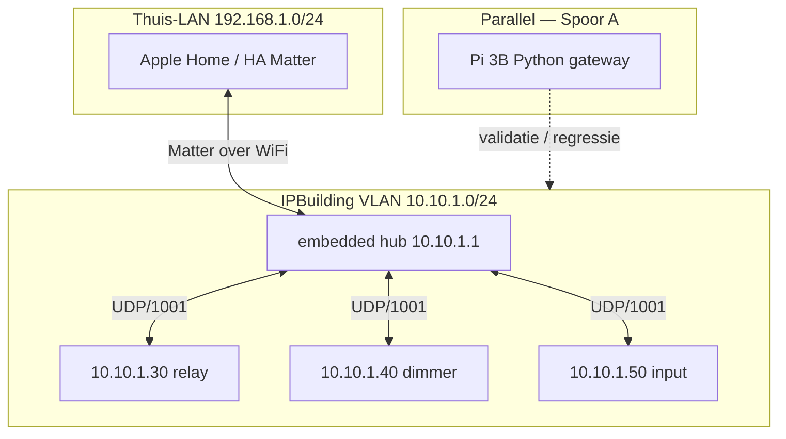

# Embedded IPBuilding Gateway — design spec

**Datum:** 2026-07-09  
**Type:** Design spec (nieuw product — Deployment C / Fase 12)  
**Status:** **Draft — pending architect review**  
**Auteur:** agent-sessie + gebruikersbeslissingen (hardware besteld: ESP32-S3-ETH)  
**Scope:** standalone embedded hub die de IPBox **veldbus-rol** overneemt en **Matter** als northbound exporteert. Geen Python-gateway naast het board in Gen 1.

**Relatie tot bestaand werk:**

| Repo / component | Rol | Status |
|------------------|-----|--------|
| [`IPBuilding-Gateway`](https://github.com/markminnoye/IPBuilding-Gateway) | Python gateway + RE + `gateway/payloads/` als **protocol-spec** | Shipping (v0.0.4) |
| [`ha-ipbuilding-gateway`](https://github.com/markminnoye/ha-ipbuilding-gateway) | HA companion (WS/REST) | Shipping — **niet** primair pad voor embedded Gen 1 |
| **`embedded-ipbuilding-gateway`** (nieuw) | C++ ESP-IDF firmware: veldbus + Matter | **Te creëren** na goedkeuring |

Canonical northbound voor Python-gateway: [`ARCHITECTURE.md`](../../../ARCHITECTURE.md). Dit document **vervangt** die northbound voor het embedded product (Matter-only Gen 1).

---

## 1. Samenvatting (executive)

### Probleem

De IPBox is dual-homed: REST op thuis-LAN, veldbus-hub op `10.10.1.1` (UDP/1001). Vervanging vereist een open hub op de veldbus **én** integratie met moderne smarthome-platformen (Apple Home, Home Assistant).

### Beslissing

**Optie B — all-in-one embedded hub:** één firmware-image op ESP32-S3 die:

1. **Veldbus-hub** is (poll, commando’s, `B-…E` ontvangen) — port van `gateway/payloads/`
2. **Device registry** bijhoudt (subset van `devices.json` op flash)
3. **Matter-endpoints** exporteert (Gen 1: relay + dimmer; Gen 2: Generic Switch voor knoppen)

**Geen** Python-gateway, **geen** WebSocket/REST op het chip in Gen 1. Logica (scenes, automations) blijft in **Home Assistant** of **Apple Home**.

### Parallel spoor (niet blokkerend)

**Raspberry Pi 3B** draait de bestaande Python-gateway (Deployment B) voor snelle veldbus-validatie en regressie. Zie [`2026-06-14-deployment-hardware-evaluation.md`](../../../resources_and_docs/reference/2026-06-14-deployment-hardware-evaluation.md).

### Lab-hardware (bevestigd)

Gebruiker heeft besteld: **Waveshare ESP32-S3-ETH** (ESP32-S3R8 + W5500). Zie §5.

---

## 2. Doelstellingen en niet-doelen

### Doelen (Gen 1 MVP)

| # | Doel | Acceptatie |
|---|------|------------|
| G1 | Hub op `10.10.1.1`, UDP/1001 naar modules `.30/.40/.50` | Relay aan/uit + dimmer level werken fysiek; evidence-log |
| G2 | Statische config op flash (`devices.json` subset) | Herstart behoudt mapping; alleen actieve kanalen als Matter-endpoint |
| G3 | Matter northbound: **On/Off** (relay), **Level Control** (dimmer) | Commissioning via Apple Home; HA Matter als test-controller |
| G4 | Dual-homed netwerk: Ethernet = veldbus, WiFi = thuis-LAN | Zelfde patroon als Pi 3B (§4) |
| G5 | Dunne hub — geen IPBox-pariteit | Geen sferen, geen knop→relay mapping in firmware |

### Niet-doelen (Gen 1)

| Item | Reden |
|------|-------|
| WebSocket `/ws`, REST `/api/v1/` op chip | Northbound = Matter-only; Python-API blijft op Pi/HA add-on |
| Runtime ARP auto-discovery | MVP: handmatige `devices.json`; discovery = Fase embedded-2 |
| Cover/screen entities | Fase 11 in Python-roadmap; embedded later |
| EEPROM-sync / `saveAutonomy` | Fase 8; belangrijk voor IP1100-autonomie, niet MVP-blocker |
| Matter Generic Switch (IP1100 knoppen) | Gen 2 — zie §12 |
| Verplicht touch-UI / display | Gen 2; USB-serial debug volstaat voor Gen 1 |
| IPBox REST-shim `:30200` | Alleen Python-transitiepad |

---

## 3. Plaats in ecosysteem



**Drie sporen naast elkaar:**

| Spoor | Product | Doelgroep |
|-------|---------|-----------|
| **A** | HA add-on + companion | Primaire HA-installatie (shipping) |
| **B** | Pi 3B standalone Python | Snelle hub-validatie, mirror-captures |
| **C** | Embedded Matter hub (dit document) | Standalone hub in zekeringskast; Apple Home-first |

De companion (`ha-ipbuilding-gateway`) blijft relevant voor Spoor A/B. Voor Spoor C praat de gebruiker **rechtstreeks met Matter-controllers**; HA Matter-bridge is optionele testlaag.

---

## 4. Netwerk

### Topologie (verplicht patroon)

Identiek aan Pi 3B dual-homed ([`ARCHITECTURE.md`](../../../ARCHITECTURE.md) §3, hardware-eval §30–46):

```
ESP32-S3-ETH
├── eth (W5500)     → IPBuilding VLAN   10.10.1.1    UDP/1001 veldbus
└── wlan (onboard)  → thuis-LAN          192.168.1.x  Matter commissioning
```

### Operationele regels

| Regel | Detail |
|-------|--------|
| Hub-IP | `10.10.1.1` binden wanneer IPBox veldbus-NIC **uit** staat |
| IPBox REST | Blijft op thuis-LAN als referentie; **niet** vervangen door embedded hub |
| UniFi | Eén Ethernet-kabel naar managed switch op IPBuilding-VLAN; PoE optioneel later |
| Firewall | Geen northbound-poort op chip; Matter gebruikt WiFi naar thuis-LAN |
| Mirror captures | Standaard `7←15` bij regressie ([playbook](../../../resources_and_docs/workflows/2026-05-14_relay_run_a_operational_playbook.md)) |

### WiFi in metalen zekeringskast

ESP32-S3-ETH heeft onboard ceramic antenna. Bij slechte RSSI in kast: later **IPEX-externe antenne** (variant met connector) of productie-board met externe antenne (§5.3).

---

## 5. Hardware

### 5.1 Bevestigde lab-hardware

| Eigenschap | ESP32-S3-ETH |
|------------|--------------|
| MCU | ESP32-S3R8 @ 240 MHz |
| RAM | 512 KB SRAM + **8 MB PSRAM** |
| Flash | 16 MB |
| Ethernet | W5500 (SPI) — 10/100 Mbps |
| Wireless | 2.4 GHz WiFi + BLE 5 |
| Voeding | USB-C (dev); PoE-module **optioneel** (niet besteld) |
| Wiki | [ESP32-S3-ETH](https://www.waveshare.com/wiki/ESP32-S3-ETH) |

**W5500 SPI-pinnen (board-default):** CS=14, INT=10, RST=9, MOSI=11, MISO=12, SCLK=13.

### 5.2 Hardware-matrix (besluitrecord)

| Profiel | Board | Wanneer |
|---------|-------|---------|
| **Lab / MVP** | **ESP32-S3-ETH** ✅ besteld | Firmware-ontwikkeling, veldbus + Matter |
| **Lab + PoE** | ESP32-S3-POE-ETH (+ module) | Test één-kabel deployment |
| **Productie zekeringskast** | ESP32-S3-POE-ETH-8DI-8DO | DIN-rail 35 mm, PoE, isolatie |
| **Premium / Gen-2 UI** | ESP32-P4-WIFI6-POE-ETH | Meer RAM, native ETH, MIPI-DSI later |
| **Afgewezen** | ESP32-S3-RS485-CAN | Geen Ethernet — geen veldbus |
| **Afgewezen** | Touch-LCD / Relay-6CH boards | Geen veldbus-Ethernet of verkeerde rol |

Firmware **MOET** board-agnostisch zijn waar mogelijk: abstractielaag `BoardProfile` (ETH interface, optional PoE flag).

### 5.3 Open hardware-vragen (architect)

- [ ] **H1:** Voldoet ESP32-S3-ETH WiFi in de fysieke zekeringskast, of is externe antenne verplicht voor Matter?
- [ ] **H2:** Productie: DIN-rail board (S3-POE-ETH-8DI-8DO) of gemonteerd dev-board in kleine behuizing?
- [ ] **H3:** PoE in productie: 802.3af via UniFi-switch — bevestigen dat switch PoE levert op IPBuilding-VLAN-poort?

---

## 6. Software-stack

| Laag | Keuze | Motivatie |
|------|-------|-----------|
| SDK | **ESP-IDF** ≥ 5.2 | Officieel Espressif; lwIP, dual-netif |
| Matter | **esp-matter** | `idf.py set-target esp32s3`; Apple Home ecosystem |
| Taal | C++17 | Consistent met ARCHITECTURE.md Deployment C |
| Build | `idf.py` + optional `esp-matter` submodule | Zelfde toolchain als Espressif docs |
| Config opslag | **LittleFS** of **SPIFFS** partitie | Statisch `devices.json` |
| Debug | USB-serial (115200) | Geen verplicht display Gen 1 |

**Niet gebruiken voor MVP:** Arduino, MicroPython, connectedhomeip direct (zonder esp-matter), Python op chip.

---

## 7. Architectuur firmware

### 7.1 Componentdiagram

```
┌─────────────────────────────────────────────────────────────┐
│                  embedded-ipbuilding-gateway                 │
│                                                              │
│  ┌──────────────┐   ┌─────────────────┐   ┌──────────────┐  │
│  │ ConfigStore  │   │ DeviceRegistry  │   │ MatterBridge │  │
│  │ (devices.json│◄──│ (runtime state) │──►│ esp-matter   │  │
│  │  on flash)   │   │                 │   │ endpoints    │  │
│  └──────────────┘   └────────┬────────┘   └──────▲───────┘  │
│                              │                    │          │
│                              ▼                    │ WiFi    │
│  ┌──────────────────────────────────────────┐    │          │
│  │           UdpBusManager (FreeRTOS task)   │    │          │
│  │  • poll loop (2s default)                 │    │          │
│  │  • command queue                          │    │          │
│  │  • listener (input B-…E)                  │    │          │
│  │  • payloads/ (C++ port)                   │    │          │
│  └──────────────────────┬───────────────────┘    │          │
│                         │ eth (10.10.1.x)        │          │
└─────────────────────────┼────────────────────────┼──────────┘
                          ▼                        ▼
                   IP0200/0300/1100          Apple Home / HA Matter
```

### 7.2 Taken en prioriteiten (FreeRTOS)

| Task | Prioriteit | Cadans |
|------|------------|--------|
| `udp_bus_poll` | Hoog | 2 s (configureerbaar) |
| `udp_bus_rx` | Hoog | Event-driven (socket) |
| `matter_stack` | Medium | esp-matter event loop |
| `config_load` | Laag | Boot + expliciete reload (later) |

### 7.3 Port van Python `gateway/payloads/`

Canonieke referentie-implementatie: [`gateway/payloads/`](../../../gateway/payloads/).

| Module | Python bron | Embedded port |
|--------|-------------|---------------|
| Relay poll | `P0000`, decode status | `payloads/relay.cpp` |
| Relay command | `S`/`C` encode | idem |
| Dimmer | `D{ch}{level}`, ramp | `payloads/dimmer.cpp` |
| Input event | `B-…E` decode | `payloads/input.cpp` — **listener only Gen 1**; geen Matter export |

**Relay status (RE 2026-06-02):** `I<ch>` geeft geen kanaalstatus; status volgt na `S`/`C` of poll-reply. Embedded implementatie volgt Python-gedrag (Scenario B).

### 7.4 Device registry

In-memory structuur, geladen uit flash-config:

```json
{
  "modules": [
    {
      "ip": "10.10.1.30",
      "type": "relay",
      "channels": [
        { "ch": 0, "name": "Keuken LED", "active": true, "semantic_type": "light" }
      ]
    }
  ]
}
```

| Veld | Gen 1 gedrag |
|------|--------------|
| `active: false` | Geen Matter-endpoint; nog wel gepollt (optioneel — architect beslist) |
| `name`, `room` | Matter endpoint naam / optional user-visible label |
| `semantic_type` | `light` → Matter On/Off + Level; `switch` → On/Off only |
| `ip`, `ch` | Veldbus routing |

**Entity-ID (intern):** `{ip}:{type}:{ch}` — zelfde conventie als Python `make_entity_id()`.

---

## 8. Matter northbound (Gen 1)

### 8.1 Endpoint-mapping

| Veldmodule | Matter device type | Clusters (minimaal) |
|------------|-------------------|---------------------|
| Relay kanaal (`semantic_type=light`) | Extended Color Light **of** On/Off Plug-in Unit | On/Off (+ Level indien van toepassing) |
| Relay kanaal (`semantic_type=switch`) | On/Off Plug-in Unit | On/Off |
| Dimmer kanaal | Dimmable Light | On/Off, Level Control |
| Input (IP1100) | — | **Gen 2:** Generic Switch |

**Architect-beslissing nodig:** exacte Matter device type per `semantic_type` (ECOS vs Plug-in Unit) — impact op Apple Home iconen.

### 8.2 Commissioning

| Controller | Transport | Opmerking |
|------------|-----------|-----------|
| **Apple Home** (primair) | WiFi + BLE | Gebruiker commissiont via iPhone op thuis-LAN |
| **Home Assistant Matter** | WiFi | Test/debug; niet verplicht voor MVP-gate |

Matter-over-Ethernet is mogelijk op ESP32-S3-ETH; Gen 1 prioriteit blijft **WiFi** voor commissioning (Apple-ervaring).

### 8.3 Wat Matter **niet** vervangt

- Geen import van IPBox-projectdatabase
- Geen button→relay acties in hub — dat blijft HA automation of Apple Home automations
- Geen REST-shim voor legacy HA-IPBuilding

---

## 9. Configuratie en provisioning (Gen 1)

| Fase | Mechanisme |
|------|------------|
| **Gen 1** | Handmatig `devices.json` flashen (LittleFS image of `idf.py` upload) |
| **Gen 1.5** | USB-serial CLI of eerste-boot SoftAP om JSON te laden |
| **Gen 2** | Companion-achtige provisioning-tool (host-side) die JSON + Matter-fabric beheert |

**Bron voor initieel JSON:** export uit bestaande `devices.json` in [`IPBuilding-Gateway`](../../../devices.json) of `POST /api/v1/devices` van Python-gateway (Pi 3B).

---

## 10. Repository-structuur (voorstel)

**Nieuwe repo:** `embedded-ipbuilding-gateway` (niet branch van Python-repo).

```
embedded-ipbuilding-gateway/
├── README.md
├── sdkconfig.defaults          # esp32s3, PSRAM, partition table
├── partitions.csv              # nvs, phy, factory, littlefs
├── main/
│   ├── CMakeLists.txt
│   ├── app_main.cpp
│   ├── board/
│   │   └── waveshare_s3_eth.cpp
│   ├── config/
│   │   └── config_store.cpp
│   ├── registry/
│   │   └── device_registry.cpp
│   ├── veldbus/
│   │   ├── udp_bus.cpp
│   │   └── payloads/           # port van gateway/payloads/
│   └── matter/
│       └── matter_bridge.cpp
├── config/
│   └── devices.example.json
├── docs/
│   └── field-test-checklist.md
└── .github/workflows/ci.yml    # build-only (idf.py build)
```

**Sync-beleid met Python-repo:** `gateway/payloads/` wijzigingen in IPBuilding-Gateway vereisen **expliciete** embedded-port + veldtest; geen automatische sync.

---

## 11. Implementatiefasen

### Fase E0 — Project bootstrap (agent-start)

| # | Taak | Done when |
|---|------|-----------|
| E0.1 | Repo `embedded-ipbuilding-gateway` aanmaken | Skeleton buildt in CI |
| E0.2 | ESP-IDF + esp-matter hello op ESP32-S3-ETH | Serial log + chip-id |
| E0.3 | W5500 link-up op IPBuilding VLAN | LINK LED + ping vanaf LAN |
| E0.4 | Dual-netif: eth static `10.10.1.1`, WiFi STA thuis-LAN | Beide interfaces up |

### Fase E1 — Veldbus MVP

| # | Taak | Done when |
|---|------|-----------|
| E1.1 | Port `payloads/relay` + `payloads/dimmer` | Unit tests + loopback |
| E1.2 | UDP poll naar `10.10.1.30` / `.40` | PCAP of mirror bevestigt `P0000` |
| E1.3 | Relay `S`/`C` + dimmer level command | Fysiek licht schakelt |
| E1.4 | `devices.json` laden van LittleFS | Alleen `active:true` kanalen in registry |
| E1.5 | Input listener `B-…E` (log only) | Serial log bij druk knop |

**Acceptatie:** veldtest-document vergelijkbaar met [`2026-06-01_gateway_field_test.md`](../../../resources_and_docs/evidence/2026-06-01_gateway_field_test.md).

### Fase E2 — Matter MVP

| # | Taak | Done when |
|---|------|-----------|
| E2.1 | esp-matter bridge: 1 relay endpoint | Apple Home schakelt 1 kanaal |
| E2.2 | Alle actieve relay + dimmer endpoints | Commissioning + on/off + dim |
| E2.3 | State sync: veldbus → Matter attribute | Status match na poll |
| E2.4 | Command path: Matter → veldbus | Toggle vanuit Apple Home |

**Acceptatie:** screen recording of testverslag; geen companion vereist.

### Fase E3 — Hardening (post-MVP)

- Optionele bind `10.10.1.1` recovery bij IPBox-conflict
- Watchdog + crash logging
- OTA (esp-matter OTA)
- PoE-module test (hardware upgrade)

### Fase E4 — Gen 2 (deferred)

| Feature | Beschrijving |
|---------|--------------|
| Matter Generic Switch | IP1100 knoppen als routeerbare events |
| Runtime discovery | lwIP ARP monitor (port van `auto_discovery.py` concept) |
| EEPROM-sync | HTTP `saveAutonomy` naar IP1100 |
| Touch UI | ESP32-P4 + MIPI-DSI of apart wandpaneel |
| Cover entities | Relay-paren |

---

## 12. Parallel spoor A — Pi 3B

| Aspect | Detail |
|--------|--------|
| Doel | Veldbus-regressie terwijl embedded firmware rijpt |
| Effort | ~0,5–2 dagen ([hardware-eval](../../../resources_and_docs/reference/2026-06-14-deployment-hardware-evaluation.md)) |
| Relatie | Geen code-shared; **wel** gedeelde `devices.json` en payload-semantiek |
| Wanneer stoppen | Embedded E2 acceptatie + 48h stabiele veldbus |

---

## 13. Risico's

| Risico | Impact | Mitigatie |
|--------|--------|-----------|
| esp-matter RAM/flash footprint | Build faalt of OTA krap | `sdkconfig` optimalisaties; start met weinig endpoints |
| W5500 SPI + Matter + WiFi concurrent | Poll jitter | Dedicated task; meet poll-latency in E1 |
| WiFi in metalen kast | Commissioning faalt | Externe antenne; test vroeg in E0 |
| Hub-IP conflict met IPBox | Dubbele hub | Operationeel: IPBox veldbus uit; documenteer in runbook |
| Payload drift Python ↔ C++ | Regressie | Gedeelde testvectoren uit `tests/test_payloads*.py` |
| Geen HA companion op embedded | Gebruiker verwacht WS | Duidelijke productcommunicatie: Matter-first |

---

## 14. Open punten voor architect-review

| ID | Vraag | Opties |
|----|-------|--------|
| **A1** | Matter device type per relay kanaal | Extended Color Light vs On/Off Plug-in Unit |
| **A2** | Poll `active:false` kanalen? | Ja (reachability) / Nee (bandwidth) |
| **A3** | Gen 1 HA-pad | Alleen Apple Home / ook HA Matter als MVP-gate |
| **A4** | Repo-koppeling | Monorepo submodule vs losse repo met sync-script |
| **A5** | Northbound na Gen 1 | MQTT bridge op chip? REST voor diagnose? |
| **A6** | Productie-hardware gate | Wanneer DIN-rail board bestellen t.o.v. E2 |
| **A7** | IPBox REST tijdens migratie | Blijft op thuis-LAN; embedded vervangt **alleen** veldbus-NIC |

---

## 15. Agent-start checklist

Wanneer architect dit document **goedkeurt**, mogen agenten starten met:

1. **E0.1** — repo aanmaken per §10
2. **Lezen:** [`gateway/payloads/`](../../../gateway/payloads/), [`RE_STATE.md`](../../../resources_and_docs/RE_STATE.md), [`IPBUILDING_KNOWLEDGE.md`](../../../resources_and_docs/IPBUILDING_KNOWLEDGE.md) §10.5
3. **Niet starten:** companion-wijzigingen, EEPROM-sync, discovery, touch UI
4. **Hardware:** ESP32-S3-ETH; IPBox veldbus uit bij veldtest
5. **Evidence:** elk veldtest-resultaat in `resources_and_docs/evidence/` (Python-repo) of `docs/field-test/` (embedded-repo)

**Blocked tot goedkeuring:** firmware-implementatie in productie-repo; wel voorbereidende doc/sync in IPBuilding-Gateway.

---

## 16. Referenties

| Document | Inhoud |
|----------|--------|
| [`ARCHITECTURE.md`](../../../ARCHITECTURE.md) | Canonical Python-gateway architectuur |
| [`AGENTS.md`](../../../AGENTS.md) | Agent-brief en roadmap |
| [`2026-06-14-deployment-hardware-evaluation.md`](../../../resources_and_docs/reference/2026-06-14-deployment-hardware-evaluation.md) | Pi / ESP32 hardware besluiten |
| [`2026-05-17_ipbuilding_fieldbus_capability_matrix.md`](../../../resources_and_docs/2026-05-17_ipbuilding_fieldbus_capability_matrix.md) | Veldbus capabilities |
| [`gateway/payloads/`](../../../gateway/payloads/) | Protocol codecs (port-source) |
| [`docs/api/websocket.md`](../api/websocket.md) | Referentie only — niet geïmplementeerd op chip Gen 1 |
| [ESP32-S3-ETH Wiki](https://www.waveshare.com/wiki/ESP32-S3-ETH) | Board pinout, Ethernet demo |
| [esp-matter ESP32-S3](https://docs.espressif.com/projects/esp-matter/en/latest/esp32/) | Matter SDK |

---

## Changelog

| Datum | Wijziging |
|-------|-----------|
| 2026-07-09 | Eerste draft — brainstorm + hardware ESP32-S3-ETH besteld |
