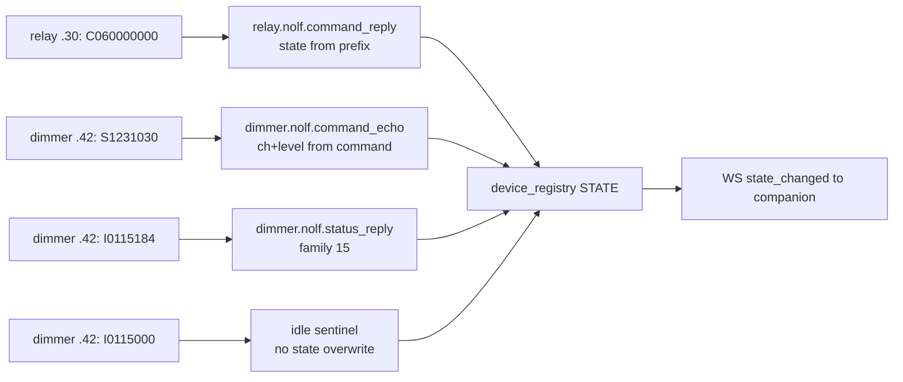

# Nolf dialect decode (gateway 1.6.5)

**Date:** 2026-08-25  
**Status:** approved for implementation  
**Repos:** IPBuilding Gateway (Python add-on only). ESP32 port is a follow-up after Jan’s field validation.  
**Context:** Nolf 2026-08-24 — relay command-echo undecoded; dimmer family `15` undecoded; HA status lags physical lights

## Problem

On Jan Nolf’s older modules the **commands work**, but Home Assistant status does not follow:

- Relay `.30` answers `S`/`C` with a **command echo** (`C060000000`), not the lab status frame `I0000{ch}{state}`. Undecoded → no `STATE` update after a toggle.
- Dimmer `.42` answers status poll / keepalive with family **`15`** (`I0115184`, idle `I0115000`) instead of lab family `54`. Undecoded → poll timeout → brightness stays Unknown.
- Dimmer `.42` also **echoes the command bytes** (`S1231030` → `S1231030`) and does **not** send a status frame. The payload already decoded as `dimmer_command`; the registry ignored it.

Core principle: **an echo from a module confirms the commanded stand**. Channel and level come from the echo itself, not from a guessed state quartet. The 20 s actuator poll (working on Nolf since 1.6.4) corrects an echo that was not physically executed.



## Two causes, one decode path

The 2026-08-24 debug log does **not** contain the incident Jan describes. He reported a relay whose HA status stayed off while the lamp turned on, but the session has **no ON command** — only two `C0600` (OFF) at 22:34:44 and 22:34:57. Startup poll seeded ch6 as `0115` = on, while HA showed off.

That is a **second cause**: gateway state and HA entity can diverge (companion / entity-sync). Evidence §3 already flags this. Echo-decode does not explain a gateway-on / HA-off mismatch.

1.6.5 may therefore fix only **one of two causes**. Both paths go through the same decode, and taking `state` from the prefix means the missing `S…` sample is not a blocker. The field checklist must **separate** the two instead of only asking “does it work now?”:

| After a switch | Meaning |
|----------------|---------|
| Gateway `/api/v1/devices` (or Web UI) matches the lamp; HA does not | Companion / entity-sync |
| Gateway is also wrong | Decode (or dual-hub reply lost to IPBox) |

## Goals

1. Relay Nolf command-echo → `STATE` immediately (`S`/`C`; `T` no state change).
2. Dimmer family-`15` poll reply → brightness/off seed (no false timeout).
3. Family-`15` idle `I0115000` does not overwrite channel state.
4. Dimmer command-echo from a dimmer IP is a state source (`S1231030` → ch1 23%).
5. Prefix-`C` dimmer command reports `level_percent: 0` (OFF must not land as 100% in HA).
6. Every new decode return carries `dialect_id`.
7. No `udp_bus` change.

## Non-goals

- Mapping `input.nolf.binary`.
- Companion code changes (verify WS `state` only).
- ESP32 payload port in this release.
- Forcing `hub_role=master` in config.
- Guessing a relay echo quartet layout (not pin-able from the OFF-only sample).

## Locked decisions (Fase 0)

### D0.1 — Relay command-reply (changed vs sprint-plan default)

Regex: `^(?P<prefix>[SCT])(?P<channel>\d{2})(?P<tail>\d{6,7})$` — **9 or 10 characters**.

- **`P` excluded (collision):** keepalive echo `P000000000` would otherwise decode as “ch0 → off” and force ch0 every poll round. Existing `_RELAY_REPLY_PULSE_RE` (`^P\d{9}$`) remains the pulse-echo path.
- **`state` from prefix, not from a quartet:** `S` → on, `C` → off, `T` → no state (`unknown`). In the only sample (`C060000000`) every candidate quartet position reads `0000`, so the layout cannot be pinned. `state_code` in the decode result is `""` (empty string, not `None` — `RelayState.state_code` and northbound snapshot are `str`). The registry **keeps the last polled quartet** when updating from an echo.
- **`tail` and `raw`** stay in the result and in the log.
- No xfail test for a hypothetical `S06000100` — state does not come from that quartet.
- **Length correction vs sprint H1:** the sprint default was exactly 10 chars with `00` + 4-digit state (`^[SCPT](?P<ch>\d{2})00(?P<state>\d{4})$`). Locked form accepts 9 or 10 chars and does not parse a quartet.
- **Second collision (`T`):** `T11001000` (input→dimmer p2p toggle, 9 chars) matches this regex and would read as relay-toggle ch11. Harmless today because `decode_relay_payload` is only called for relay-module IPs — a **routing guarantee**, not a property of the regex. Document with a comment on the regex plus a test that makes the assumption explicit.

Evaluate the new regex **after** `_RELAY_CMD_RE`, the status regexes, and `_RELAY_REPLY_PULSE_RE`.

Return shape:

```python
{
    "dialect_id": "relay.nolf.command_reply",
    "family": "relay_command_reply",
    "action": "on" | "off" | "toggle",
    "channel": 6,
    "state": "on" | "off" | "unknown",   # from prefix; T → unknown
    "state_code": "",
    "tail": "060000000",
    "raw": text,
}
```

On successful decode: one INFO line  
`decoded relay.nolf.command_reply from 10.10.1.30: C060000000 (ch6 → off)`.

No wiring change: the log already proves the registry sees the packet (`undecoded RX from 10.10.1.30: C060000000`).

### D0.2 — `99` = 100% (option 1)

Same as lab. Ground truth: [2026-05-17_dimmer_I0154xxx_full_decode.md](../../../resources_and_docs/evidence/2026-05-17_dimmer_I0154xxx_full_decode.md) rule 71 (`099` = ch0 + `99` = 100%). No evidence that Nolf diverges. Supporting: poll reported ch1 = 84%, after which Jan dimmed exactly that channel to 23% / 47% / off.

### D0.2b — Family-`15` idle sentinel `000` (new)

`I0115000` is an **idle sentinel** for family `15` (like `999` for family `54`): no channel/level, **no state overwrite**.

Rationale: the directed poll reported ch0 = `099` (100%) while the keepalive seconds later said `000`, with no command in between. A global `000` sentinel would break valid lab status `I0154000` (ch0 off after `C0…`). Idle is therefore **strictly family-scoped**: `999` only for family `54`, `000` only for family `15`.

Jan confirms with a glance at the Zithoek lamp (ch0) during keepalive.

`dialect_id`: `dimmer.nolf.idle_keepalive`; `family`: `dimmer_poll`; `action`: `idle`.

### D0.3 — No `udp_bus` change (A confirmed)

`_dimmer_status_predicate` fails solely because family `15` does not decode. Once it does, `sweep_dimmer_states` correlates. Do not widen wait windows.

`state_poll.py` and `udp_bus.py` stay unchanged.

### D0.4 / D0.5 — Unchanged

- **D0.4:** field-test first **with IPBox still on the bus** (current `hub_role=slave`), then repeat **with IPBox ethernet unplugged**.
- **D0.5:** every decode return includes `dialect_id`.

Slave-mode caveat: replies may still go to the IPBox instead of the gateway.

### Scope — Python-only

Gateway add-on **1.6.5**. Embedded ESP32 port is a follow-up **after** Jan’s field validation (manual sync policy A4).

## Dimmer decode

1. Generalise `_DIMMER_REPLY_RE` to `^I01(?P<family>54|15)(?P<value_code>\d{3})$` with `dialect_id` per family (`dimmer.lab.status_reply` / `dimmer.nolf.status_reply`). `{ccc}` = `{ch}{vv}` as lab.
2. Idle sentinel family-scoped (D0.2b).
3. **Decoder bugfix:** `dimmer_command` with prefix `C` yields `level_percent: 0`. Today it is 100 because `encode_dim_off` sends placeholder `C{ch}991030` and `99` is translated independently of the prefix. `value_code` stays `"99"` in the result. Once the echo is a state source this is behavioural, not cosmetic: an OFF would otherwise land as 100% in HA.
4. In `_handle_dimmer`: family `dimmer_command` from a dimmer IP is a state source (`dialect_id: dimmer.nolf.command_echo`) — `S1231030` → ch1 23%, `C1991030` → ch1 0%. Lab dimmers still reply `I0154…`, so they are unaffected.

## REST-shim blast radius

[`gateway/rest_shim.py`](../../../gateway/rest_shim.py) returns the parsed reply verbatim (`"reply": reply_parsed`). After the C-prefix fix, `level_percent` of an OFF reply changes from **100 to 0**. Correcter, but a visible API change — call it out in the add-on CHANGELOG.

## Tests (golden vectors from the Nolf log)

Out of scope for this spec’s implementation todos; required for the release:

- Relay: `C060000000` → ch6/off, `state_code == ""`; `P000000000` stays `relay_reply_candidate`; `T11001000` documented as p2p frame kept off this path by routing; lab `I000060115` / `I000050015` unchanged.
- Dimmer: `I0115184` → ch1/84%, `I0115099` → ch0/100%, `I0115300` → ch3/0%, `I0115000` → idle without channel; lab `I0154130` / `I0154199` / `I0154999` unchanged; `C1991030` → ch1/0%.
- Registry: relay echo updates state and preserves `state_code`; echo-as-first-packet leaves `state_code == ""` without warning; dimmer echo sets level including OFF → 0%; `I0115000` does not overwrite an existing level.
- State poll: simulated `I0000000` → `I0115099` seeds ch0 without timeout.

## Field validation (leave open until Jan replies)

Canonical checklist: [2026-08-24_jan_nolf_field_test.md §8](../../../resources_and_docs/evidence/2026-08-24_jan_nolf_field_test.md). Must include:

- Relay **ch9 ON then OFF** (missing `S09…` echo sample).
- Dimmer **ch1 Lichtstraat at 50%**.
- Zithoek **ch0 during keepalive** (D0.2b).
- Gateway `/api/v1/devices` vs HA entity (two-causes diagnosis).
- Repeat after IPBox ethernet out.
- Slave-mode caveat.

## Related docs

- Dialect registry: [veldbus_dialect_registry.md](../../../resources_and_docs/reference/veldbus_dialect_registry.md)
- Evidence: [2026-08-24_jan_nolf_field_test.md](../../../resources_and_docs/evidence/2026-08-24_jan_nolf_field_test.md)
- Sprint plan (superseded D0.1 default): [2026-08-24-nolf-dialect-sprint-plan.md](../plans/2026-08-24-nolf-dialect-sprint-plan.md)
- Lab dimmer decode: [2026-05-17_dimmer_I0154xxx_full_decode.md](../../../resources_and_docs/evidence/2026-05-17_dimmer_I0154xxx_full_decode.md)
