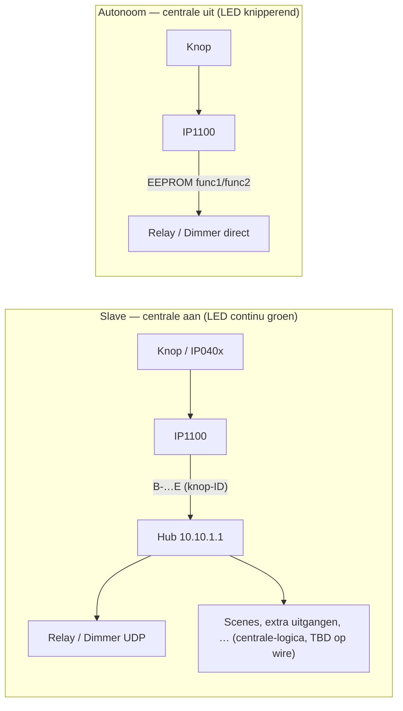

# Sprint 5 — physical input (completion)

Last updated: 2026-05-22

**Status:** GESLAAGD — fysieke druk op IP1100 gedocumenteerd op de veldbus; **logische flow** (wie beslist welke relay/dimmer actie) blijft **open** (zie §Logical flow — later).

**Test plan:** [2026-05-17_RE_TEST_PLAN_5_SPRINTS.md](../archive/2026-05-17_RE_TEST_PLAN_5_SPRINTS.md) §Sprint 5.

**Canonieke RE-index:** [RE_STATE.md](../RE_STATE.md).

---

## Captures (manual Wireshark, operator A/B/C)

| Session | Mirror | POV | File (operator) | Focus |
|---------|--------|-----|-----------------|-------|
| Early relais | **7←14** | Relay port `10.10.1.30` | `~/Downloads/10-05.pcapng` | Inkom (ch10) toggle; incomplete second OFF in first run |
| Relais clean | **7←14** | Relay port | `~/Downloads/10:22.pcapng` | Inkom ON/OFF ~6s/13s; Traphal ch14 ON/OFF ~36s/43s |
| **Input wire** | **7←13** | Input port `10.10.1.50` | `~/Downloads/10:25.pcapng` | 60× UDP/1001 input↔hub; **12× `B-…E` button events** |

Operator mapping (physical labels A/B/C):

| Button | Load (intent) | `getButtons` name (example) | `func1` target |
|--------|---------------|----------------------------|----------------|
| **A** | Inkom (relais ch10) | Woonkamer hal L | relay `.30` ch **10** |
| **B** | Living (dimmer) | Trap R | dimmer `.40` ch **0** |
| **C** | Traphal (relais ch14) | Trap L | relay `.30` ch **14** |

Detail timestamps and hex: [2026-05-22_sprint5_input_10-25_session_notes.md](2026-05-22_sprint5_input_10-25_session_notes.md).

**Note:** Planned archive paths `captures/2026-05-22T102500Z_sprint5-manual-10-25/` etc. may be added when pcaps are copied into the repo; evidence today is operator Downloads + this write-up.

---

## Wire findings (confirmed)

### Payload families

| Family | Dir | Len | Pattern | Role |
|--------|-----|-----|---------|------|
| Poll | hub→input | 4 | `I0000` | ~2 s keepalive |
| Idle reply | input→hub | 14 | `I\x02R` + 3 status bytes + 7× `00` + `E` | Unchanged when no press |
| Button event | input→hub | 13 | `B-` + 6-byte `id_core` + 1-byte suffix + `03` + `01`/`00` + `00` + `E` | Press (`01`) / release (`00`), ~200 ms pairs |

### ID correlation

- `GET http://10.10.1.50/api.html?method=getButtons` → each button has hex `id` (e.g. `2D2F8185190000DF`).
- Wire: `id_core` = bytes from `id[2:14]` (skip `2D` prefix), `id_suffix` = `id[14:16]` as one byte.
- IPBox REST inventaris gebruikt numerieke entity-IDs; koppel via **`descr`** / wizard data, niet via de wire-`id`.

### Path on Ethernet (slave / centrale up)

```
[IP040x] ── Cat5 ──► [IP1100 10.10.1.50]
                           │ UDP/1001 B-…E
                           ▼
                    [Centrale 10.10.1.1]
                           │ UDP/1001 T/S/C/…
                           ├──► [Relay 10.10.1.30]
                           └──► [Dimmer 10.10.1.40]
```

In Sprint 5 captures: **geen** unicast `10.10.1.50` → `.30` / `.40` op de mirror — input praat alleen met de hub; hub stuurt commando’s (zichtbaar op **7←14** / **7←15**, niet op input-poort).

---

## Architectuurdoel

**Centrale laat bij een drukknop “meer” aansturen (slave-modus).** Intentie: de IP1100 is op Ethernet een **sensor** (*welke knop, press/release*). De **hub** is de **beslisser**: bij `B-…E` kan zij **meerdere** dingen aansturen — niet alleen één relais of dimmer, maar alles wat in het IPBuilding-project staat (uitgangen, sferen/scenes, timers, groepsacties, …). Dat volgt uit:

- Wire: input → hub alleen; hub → modules (Sprint 5).
- IPBox REST + WebConfig: knoppen als **logische entiteiten** gekoppeld aan comp/items en scenes (northbound/centrale-laag).
- Module `func1`/`func2`: **vereenvoudigde lokale** koppeling (max. twee doelen per knop) — waarschijnlijk referentie + **autonomie-EEPROM**, niet het volledige centrale-gedrag in slave-modus.

| Wat de hub kan aansturen (voorbeelden) | Wire bevestigd Sprint 5? | Waar gedefinieerd (vermoeden) |
|----------------------------------------|---------------------------|-------------------------------|
| Relais ON/OFF/toggle (`T`/`S`/`C`) | Ja (knop A/C, mirror 7←14) | Centrale → `10.10.1.30` |
| Dimmer (`S`/`C` + value-code) | Nog niet op dimmer-mirror | Centrale → `10.10.1.40` |
| Meerdere uitgangen / “all on-off” | Nee (logische laag) | IPBox project / handleiding acties |
| Scenes / sferen | Nee (logische laag) | REST scenes, WebConfig wizards |
| Andere module-IP’s in het project | Nee | Centrale database |

**Exacte mapping** knop-ID → actielijst op de IPBox: **nog niet gereverse-engineered** (zie §Logical flow — later).

### Slave vs autonoom (twee modi)



Zie ook [IPBUILDING_KNOWLEDGE.md](IPBUILDING_KNOWLEDGE.md) §12.5 (master/slave, autonomie flashen).

---

## Logical flow — definition later (documented gap)

Wat we **vandaag** weten vs wat we **later** uitpluizen:

| Layer | Status | Where it lives (hypothesis) |
|-------|--------|-----------------------------|
| **Wire event** | Confirmed | Input → hub `B-…E`; hub polls `I0000` |
| **Hub → veldbus-acties** | Deels confirmed | Relay-commando’s na druk; dimmer/scenes nog open op wire |
| **Per-button targets (lokaal)** | Partially visible | Module `getButtons` / `backupConfig` `pushbuttons[].func1/func2` (`ip` = last octet → `10.10.1.30` / `.40`) |
| **Project / centrale logic** | **Not reversed** | IPBox WebConfig (`ImportInput`, Pushbuttons wizard, comp/items), service DB, `FlashAutonomyToModule` — see [RE_WIZARDS_PLAN.md](../reference/2026-05-17_RE_WIZARDS_PLAN.md) |
| **Autonomous fallback** | Documented, not wire-captured | EEPROM / `.IPA` per install manual §12.5; input may command modules **direct** when centrale down (LED blink) |

**Gateway implication:** In **slave mode** moet de eigen centrale (1) input pollen, (2) `B-…E` decoderen, (3) een **eigen registry** `knop-ID → [acties]` hebben — inclusief “meer dan func1” (meerdere relays, dimmer, scene-triggers). Module-`func1` is hoogstens hint of fallback; IPBox-projectregels zijn **TBD**.

---

## Centrale IP (how input finds the hub)

Checked live on `10.10.1.50`:

- `getSysSet` / `backupConfig` **network.gateway** = `10.10.1.254` (router), **not** `10.10.1.1`.
- **No** `10.10.1.1` field in exported module JSON.

**Working assumptions (ranked):**

1. **Ecosystem convention** — centrale fixed at `10.10.1.1` on `10.10.1.0/24` (install manual §12.1; IPBox factory hub IP).
2. **Learned from polls** — hub sends `I0000` from `10.10.1.1`; input may cache that source for unsolicited `B-…E` (not wire-proven vs hardcoded).
3. **UDP/10001 discovery** — hub probes; module reply path not documented on HTTP config.

Eigen gateway moet op het veld-VLAN als **`10.10.1.1`** (of bewijs leveren dat modules een ander hub-IP accepteren). Zie `gateway/config.py` `GATEWAY_HUB_IP`.

---

## Code and parsers

| Artifact | Role |
|----------|------|
| `gateway/payloads/input.py` | Poll encode + idle / event decode |
| `scripts/input_payload_parser.py` | CLI wrapper |
| `tests/test_input_payloads.py` | Regression |

---

## Open follow-ups (post–Sprint 5)

1. **Logical flow RE** — IPBox input wizard, project DB ↔ module sync, scene triggers on wire.
2. **Dimmer leg** — mirror **7←15** or **7←12** while pressing button B (hub→dimmer bytes).
3. **Autonomous mode capture** — centrale off + mirror 7←13 and 7←14 (validate direct input→module path).
4. **Hub IP mechanism** — experiment: hub on non-`.1` IP or press before first poll after reboot.

---

## Evidence index

- [2026-05-17_ip1100_input_payload_decode.md](2026-05-17_ip1100_input_payload_decode.md)
- [2026-05-22_sprint5_input_10-25_session_notes.md](2026-05-22_sprint5_input_10-25_session_notes.md)
- [2026-05-17_ipbuilding_fieldbus_capability_matrix.md](../2026-05-17_ipbuilding_fieldbus_capability_matrix.md)
- [IPBUILDING_KNOWLEDGE.md](IPBUILDING_KNOWLEDGE.md) §2C, §12.4–12.5
